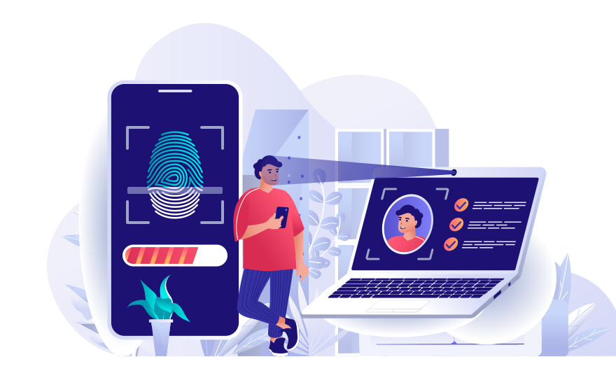

Passwordless.ID / webauthn
==========================

A greatly simplified and opinionated wrapper to invoke the [webauthn protocol](https://w3c.github.io/webauthn/) more conveniently.
It is an [open source](https://github.com/passwordless-id/webauthn), dependency-free and minimalistic library (17kb only, from which 11kb is the list of authenticator aaguids/names).



> This library is used in [Passwordless.ID](https://passwordless.id), a free public identity provider based on WebAuthn.

Try out the playground to see how this library works:

### *[Testing Playground](https://webauthn.passwordless.id/demos/playground.html)*

Other demos with minial examples:

- [Basic Demo](https://webauthn.passwordless.id/demos/basic.html)
- [Minimal Example (CDN)](https://webauthn.passwordless.id/demos/example-cdn.html)
- [Minimal Example (repository)](https://webauthn.passwordless.id/demos/example-raw.html)
- [Authenticators list](https://webauthn.passwordless.id/demos/authenticators.html)

The source of all demos is on [GitHub](https://github.com/passwordless-id/webauthn)


How does the protocol work?
---------------------------

This diagram shows how the webauthn protocol works, slightly simplified.


Further documentation about the protocol can be found in the webauthn guide at [Passwordless.ID](https://passwordless.id).


Installation / Usage
--------------------

### NPM

```bash
npm install @passwordless-id/webauthn
```

```js
import * as webauthn from '@passwordless-id/webauthn'
```

### Browser

```html
<script type="module">
  import { client } from 'https://unpkg.com/@passwordless-id/webauthn@1.6.1/dist/webauthn.min.js'
</script>
```
### Import

The `webauthn` module is basically a "bundle" composed of the following modules:

- `client`: used for invoking webauthn in the browser
- `server`: used for verifying responses in the server
- `parsers`: used to parse part or all of the encoded data without verifications
- `utils`: various encoding, decoding, challenge generator and other utils

It was designed that way so that you can import only the module(s) you need. That way, the size of your final js bundle is reduced even further. Importing all is dependency free and < 10kb anyway.

So you might for example `import { client } from '@passwordless-id/webauthn'` for browser side stuff and `import { server } from '@passwordless-id/webauthn'` for server side stuff.

### Runs in...

- In Chrome, Edge, Firefox, Safari
- NodeJS **19+** (*)
- Cloudflare Workers
- Probably in most recent browsers/servers

(*) For older Node versions, take a look at [Arch0125's fork](https://github.com/Arch0125/webauthn/tree/nodev14-v16-support). (The reason of the Node 19+ compatibility is basically `WebCrypto` being globally available, making it possible to use the same build for all targets: browser, node, clouflare workers...)

Utilities
---------

```js
import { client } from '@passwordless-id/webauthn' 

client.isAvailable()
```

Returns `true` or `false` depending on whether the Webauthn protocol is available on this platform/browser.
Particularly linux and "exotic" web browsers might not have support yet.

---

```js
await client.isLocalAuthenticator()
```

This promise returns `true` or `false` depending on whether the device itself can act as authenticator. Otherwise, a "roaming" authenticator like a smartphone or usb security key can be used. This information is mainly used for information messages and user guidance.


Registration
------------

### Overview

The registration process occurs in four steps:

1. The browser requests a challenge from the server
2. The browser triggers `client.register(...)` and sends the result to the server
3. The server parses and verifies the registration payload
4. The server stores the credential key of this device for the user account

Note that unlike traditional authentication, the credential key is attached to the device. Therefore, it might make sense for a single user account to have multiple credential keys.


### 1. Requesting challenge

The challenge is basically a [nonce](https://en.wikipedia.org/wiki/nonce) to avoid replay attacks.

```
const challenge = /* request it from server */
```

Remember it on the server side during a certain amount of time and "consume" it once used.

### 2. Trigger registration in browser

Example call:

```js
import { client } from '@passwordless-id/webauthn' 

const challenge = "a7c61ef9-dc23-4806-b486-2428938a547e"
const registration = await client.register("Arnaud", challenge, {
  authenticatorType: "auto",
  userVerification: "required",
  timeout: 60000,
  attestation: true,
  userHandle: "Optional server-side user id. Must not reveal personal information.",
  debug: false
})
```

Parameters:

- `username`: The desired username.
- `challenge`: A server-side randomly generated string.
- `options`: See [below](#options).

The `registration` object looks like this:

```json
{
  "username": "Arnaud",
  "credential": {
    "id": "3924HhJdJMy_svnUowT8eoXrOOO6NLP8SK85q2RPxdU",
    "publicKey": "MFkwEwYHKoZIzj0CAQYIKoZIzj0DAQcDQgAEgyYqQmUAmDn9J7dR5xl-HlyAA0R2XV5sgQRnSGXbLt_xCrEdD1IVvvkyTmRD16y9p3C2O4PTZ0OF_ZYD2JgTVA==",
    "algorithm": "ES256"
  },
  "authenticatorData": "SZYN5YgOjGh0NBcPZHZgW4_krrmihjLHmVzzuoMdl2NFAAAAAAiYcFjK3EuBtuEw3lDcvpYAIN_duB4SXSTMv7L51KME_HqF6zjjujSz_EivOatkT8XVpQECAyYgASFYIIMmKkJlAJg5_Se3UecZfh5cgANEdl1ebIEEZ0hl2y7fIlgg8QqxHQ9SFb75Mk5kQ9esvadwtjuD02dDhf2WA9iYE1Q=",
  "clientData": "eyJ0eXBlIjoid2ViYXV0aG4uY3JlYXRlIiwiY2hhbGxlbmdlIjoiYTdjNjFlZjktZGMyMy00ODA2LWI0ODYtMjQyODkzOGE1NDdlIiwib3JpZ2luIjoiaHR0cDovL2xvY2FsaG9zdDo4MDgwIiwiY3Jvc3NPcmlnaW4iOmZhbHNlfQ=="
}
```

Then simply send this object as JSON to the server.

### 3. Verify it server side


```js
import { server } from '@passwordless-id/webauthn' 

const expected = {
    challenge: "a7c61ef9-dc23-4806-b486-2428938a547e", // whatever was randomly generated by the server
    origin: "http://localhost:8080",
}
const registrationParsed = await server.verifyRegistration(registration, expected)
```

Either this operation fails and throws an Error, or the verification is successful and returns the parsed registration.
Example result:

```json
{
  "username": "Arnaud",
  "credential": {
    "id": "3924HhJdJMy_svnUowT8eoXrOOO6NLP8SK85q2RPxdU",
    "publicKey": "MFkwEwYHKoZIzj0CAQYIKoZIzj0DAQcDQgAEgyYqQmUAmDn9J7dR5xl-HlyAA0R2XV5sgQRnSGXbLt_xCrEdD1IVvvkyTmRD16y9p3C2O4PTZ0OF_ZYD2JgTVA==",
    "algorithm": "ES256"
  },
  "authenticator": {
    ...
    "name": "Windows Hello",
    "icon_dark": "https://webauthn.passwordless.id/authenticators/08987058-cadc-4b81-b6e1-30de50dcbe96-dark.png",
    "icon_light": "https://webauthn.passwordless.id/authenticators/08987058-cadc-4b81-b6e1-30de50dcbe96-light.png",
    "synced": true
  },
  ...
}
```

> **NOTE:** Currently, the *attestation* which proves the exact model type of the authenticator is *not verified*. [Do I need attestation?](https://medium.com/webauthnworks/webauthn-fido2-demystifying-attestation-and-mds-efc3b3cb3651)

### 4. Store the credential key

The credential key is the most important part and should be stored in a database for later since it will be used to verify the authentication signature.

```json
"credential": {
  "id": "3924HhJdJMy_svnUowT8eoXrOOO6NLP8SK85q2RPxdU",
  "publicKey": "MFkwEwYHKoZIzj0CAQYIKoZIzj0DAQcDQgAEgyYqQmUAmDn9J7dR5xl-HlyAA0R2XV5sgQRnSGXbLt_xCrEdD1IVvvkyTmRD16y9p3C2O4PTZ0OF_ZYD2JgTVA==",
  "algorithm": "ES256"
},
```

*Please note that unlike traditional systems, you might allow a user to have multiple credential keys.
For example, if you allow the user to use multiple device-bound keys and/or registering keys for multiple platforms.*


Authentication
--------------

### Overview

There are two kinds of authentications possible:

- by providing a list of allowed credential IDs
- by letting the platform offer a default UI to select the user and its credential

Both have their pros & cons (TODO: article).

The authentication procedure is similar to the procedure and divided in four steps.

1. The browser requests a challenge from the server
2. The browser triggers `client.authenticate(...)` and sends the result to the server
3. The server loads the credential key used for authentication
4. The server parses and verifies the authentication payload


### 1. Requesting challenge

The challenge is basically a [nonce](https://en.wikipedia.org/wiki/nonce) to avoid replay attacks.

```
const challenge = /* request it from server */
```

Remember it on the server side during a certain amount of time and "consume" it once used.

### 2. Trigger authentication in browser

Example call:

```js
import { client } from '@passwordless-id/webauthn'

const challenge = "56535b13-5d93-4194-a282-f234c1c24500"
const authentication = await client.authenticate(["3924HhJdJMy_svnUowT8eoXrOOO6NLP8SK85q2RPxdU"], challenge, {
  "authenticatorType": "auto",
  "userVerification": "required",
  "timeout": 60000
})
```

Example response:

```json
{
  "credentialId": "3924HhJdJMy_svnUowT8eoXrOOO6NLP8SK85q2RPxdU",
  "authenticatorData": "SZYN5YgOjGh0NBcPZHZgW4_krrmihjLHmVzzuoMdl2MFAAAAAQ==",
  "clientData": "eyJ0eXBlIjoid2ViYXV0aG4uZ2V0IiwiY2hhbGxlbmdlIjoiNTY1MzViMTMtNWQ5My00MTk0LWEyODItZjIzNGMxYzI0NTAwIiwib3JpZ2luIjoiaHR0cDovL2xvY2FsaG9zdDo4MDgwIiwiY3Jvc3NPcmlnaW4iOmZhbHNlLCJvdGhlcl9rZXlzX2Nhbl9iZV9hZGRlZF9oZXJlIjoiZG8gbm90IGNvbXBhcmUgY2xpZW50RGF0YUpTT04gYWdhaW5zdCBhIHRlbXBsYXRlLiBTZWUgaHR0cHM6Ly9nb28uZ2wveWFiUGV4In0=",
  "signature": "MEUCIAqtFVRrn7q9HvJCAsOhE3oKJ-Hb4ISfjABu4lH70MKSAiEA666slmop_oCbmNZdc-QemTv2Rq4g_D7UvIhWT_vVp8M="
}
```

Parameters:

- `credentialIds`: The list of credential IDs that can be used for signing.
- `challenge`: A server-side randomly generated string, the base64url encoded version will be signed.
- `options`: See [below](#options).


### 3. In the server, load the credential key

```js
import { server } from '@passwordless-id/webauthn' 

const credentialKey = { // obtained from database by looking up `authentication.credentialId`
    id: "3924HhJdJMy_svnUowT8eoXrOOO6NLP8SK85q2RPxdU",
    publicKey: "MFkwEwYHKoZIzj0CAQYIKoZIzj0DAQcDQgAEgyYqQmUAmDn9J7dR5xl-HlyAA0R2XV5sgQRnSGXbLt_xCrEdD1IVvvkyTmRD16y9p3C2O4PTZ0OF_ZYD2JgTVA==",
    algorithm: "ES256"
} as const

const expected = {
    challenge: "56535b13-5d93-4194-a282-f234c1c24500", // whatever was randomly generated by the server.
    origin: "http://localhost:8080",
    userVerified: true, // should be set if `userVerification` was set to `required` in the authentication options (default)
    counter: 123 // Optional. For device-bound credentials, you should verify the authenticator "usage" counter increased since last time.
}
```

Regarding the `counter`, it might or might not be implemented by the authenticator.
Typically, it's implemented by hardware-bound keys to detect and avoid the risk of cloning the authenticator and starts with 1 during registration.
On the opposite, for password managers syncing keys in the cloud, the counter is typically always 0 since in that case cloning is a "feature".
For example, device-bound keys on Android and Windows do have an increasing `counter`, USB security keys also, while MacOS/iOS do not.
Lastly, please note that the specs do not mandate "+1" increases, it could theoretically increase by any amount.

Often, it might also be more practical to use functions to verify challenge or origin. This is possible too:

```js
const expected = {
    challenge: async (challenge) => { /* async call to DB for example */ return true },
    origin: (origin) => listOfAllowedOrigins.includes(origin),
    userVerified: true, // no function allowed here
    counter: 123,  // optional, no function allowed here
    verbose: true, // optional, enables debug logs containing sensitive information
}
```

### 4. Verify the authentication

```js
const authenticationParsed = await server.verifyAuthentication(authentication, credentialKey, expected)
```

Either this operation fails and throws an Error, or the verification is successful and returns the parsed authentication payload.

Please note that this parsed result `authenticationParsed` has no real use. It is solely returned for the sake of completeness. The `verifyAuthentication` already verifies the payload, including the signature.


Remarks
-------

### The `challenge` is critical

The challenge must be a random value.
Otherwise, your implementation might become vulnerable to replay attacks. 


### There can be multiple credentials per user ID

Unlike traditional authentication, you might have multiple credential keys per user.

### Authentication does *not* provide `username` out of the box

Only `credentialId` is provided during the authentication.

So either you maintain a mapping `credentialId -> username` in your database, or you add the `username` in your frontend to backend communication.


### Passkeys a.k.a "discoverable" credentials

If the credential is [discoverable](https://w3c.github.io/webauthn/#client-side-discoverable-public-key-credential-source), the credential id and user information is kept on the system. Although you can "discourage" it, there is no option in the spec to "forbid" it. For example, iOS always use "discoverable" keys, even if the option is set to `"discouraged"`

Afterwards, you can use `client.authenticate([], ...)` without specifying credential IDs. In that case, the platform will pop-up a default dialog to let you pick a user and perform authentication. Of course, the look and feel is platform specific.


### Disable synced credentials

That is sadly impossible, the spec authors refuse to add an option to disable syncing.

See:

- https://github.com/w3c/webauthn/issues/1714
- https://github.com/w3c/webauthn/issues/1739

Note that in practice, and although not precised by the specs, the "discoverable" property has an impact on syncing in the cloud. As of end 2023, for Microsoft and Android, when marked as `discoverable: "discouraged"`, they are not synced in the cloud ...but still discoverable. Since this is not covered by the specs, this might change in the future.


### This library simplifies a few things by using sensible defaults

Unlike the [WebAuthn protocol](https://w3c.github.io/webauthn/), some defaults are different:

- The `timeout` is one minute by default.
- If the device can act as authenticator itself, it is preferred instead of asking which authenticator type to use.
- The `userVerification` is required by default.
- The protocol "Relying Party ID" is always set to be the origin domain
- The `username` is used for both the protocol level user "name" and "displayName"


Common options
--------------

The following options are available for both `register` and `authenticate`.

- `timeout`: Number of milliseconds the user has to respond to the biometric/PIN check. *(Default: 60000)*
- `userVerification`: Whether to prompt for biometric/PIN check or not. *(Default: "required")*
- `authenticatorType`: Which device to use as authenticator. Possible values:
    - `'auto'`: if the local device can be used as authenticator it will be preferred. Otherwise it will prompt for a roaming device. *(Default)*
    - `'local'`: use the local device (using TouchID, FaceID, Windows Hello or PIN)
    - `'roaming'`: use a roaming device (security key or connected phone)
    - `'both'`: prompt the user to choose between local or roaming device. The UI and user interaction in this case is platform specific.
- `domain`: by default, the current domain name is used. Also known as "relying party id". You may want to customize it for ...
   - a parent domain to let the credential work on all subdomains
   - browser extensions requiring specific IDs instead of domains ?
   - specific iframes use cases?
- `debug`: If enabled, parses the "data" objects and provide it in a "debug" properties.


Registration options
--------------------

- `discoverable`: (`'discouraged'`, `'preferred'` or `'required'`) If the credential is "discoverable", it can be selected using `authenticate` without providing credential IDs. In that case, a native pop-up will appear for user selection. This may have an impact on the "passkeys" user experience and syncing behavior of the key. *(Default: 'preferred')*
- `attestation`: If enabled, the device attestation and clientData will be provided as base64 encoded binary data. Note that this may impact the authenticator information available or the UX depending on the platform. *(Default: false)* 
- `userHandle`: The user "handle" (also known as user "id") can be used to re-register credentials for an existing user, thus overriding the current credential key pair and username for that `userHandle`. *The default here is based on a hash of the `username`, and thus has some security implications as described in [issue](https://github.com/passwordless-id/webauthn/issues/29).*


Authentication options
----------------------

- `mediation`: See https://developer.mozilla.org/en-US/docs/Web/API/CredentialsContainer/get#mediation


Verification options
--------------------

- `userVerified`: to ensure that the user has been verified by the authenticator
- `counter`: this should be an incrementing value on each authentication, but it was made optional according to https://github.com/passwordless-id/webauthn/issues/38
- `domain`: in case you used a specific domain (relying party id) during registration/authentication, you need this too during verification
- `verbose`: prints more details to the console if enabled


Parsing data
------------

If you want to parse the encoded registration, authentication or parts of it without verifying it, it is possible using the `parsers` module. This might be helpful when debugging.

### Registration

```js
import { parsers } from '@passwordless-id/webauthn'

parsers.parseRegistration({
      "username": "Arnaud",
      "credential": {
        "id": "3924HhJdJMy_svnUowT8eoXrOOO6NLP8SK85q2RPxdU",
        "publicKey": "MFkwEwYHKoZIzj0CAQYIKoZIzj0DAQcDQgAEgyYqQmUAmDn9J7dR5xl-HlyAA0R2XV5sgQRnSGXbLt_xCrEdD1IVvvkyTmRD16y9p3C2O4PTZ0OF_ZYD2JgTVA==",
        "algorithm": "ES256"
      },
      "authenticatorData": "SZYN5YgOjGh0NBcPZHZgW4_krrmihjLHmVzzuoMdl2NFAAAAAAiYcFjK3EuBtuEw3lDcvpYAIN_duB4SXSTMv7L51KME_HqF6zjjujSz_EivOatkT8XVpQECAyYgASFYIIMmKkJlAJg5_Se3UecZfh5cgANEdl1ebIEEZ0hl2y7fIlgg8QqxHQ9SFb75Mk5kQ9esvadwtjuD02dDhf2WA9iYE1Q=",
      "clientData": "eyJ0eXBlIjoid2ViYXV0aG4uY3JlYXRlIiwiY2hhbGxlbmdlIjoiYTdjNjFlZjktZGMyMy00ODA2LWI0ODYtMjQyODkzOGE1NDdlIiwib3JpZ2luIjoiaHR0cDovL2xvY2FsaG9zdDo4MDgwIiwiY3Jvc3NPcmlnaW4iOmZhbHNlfQ=="
    })
```


```json
{
  "username": "Arnaud",
  "credential": {
    "id": "3924HhJdJMy_svnUowT8eoXrOOO6NLP8SK85q2RPxdU",
    "publicKey": "MFkwEwYHKoZIzj0CAQYIKoZIzj0DAQcDQgAEgyYqQmUAmDn9J7dR5xl-HlyAA0R2XV5sgQRnSGXbLt_xCrEdD1IVvvkyTmRD16y9p3C2O4PTZ0OF_ZYD2JgTVA==",
    "algorithm": "ES256"
  },
  "client": {
    "type": "webauthn.create",
    "challenge": "a7c61ef9-dc23-4806-b486-2428938a547e",
    "origin": "http://localhost:8080",
    "crossOrigin": false
  },
  "authenticator": {
    "rpIdHash": "SZYN5YgOjGh0NBcPZHZgW4_krrmihjLHmVzzuoMdl2M=",
    "flags": {
      "userPresent": true,
      "userVerified": true,
      "backupEligibility": false,
      "backupState": false,
      "attestedData": true,
      "extensionsIncluded": false
    },
    "counter": 0,
    "aaguid": "08987058-cadc-4b81-b6e1-30de50dcbe96",
    "name": "Windows Hello",
    "icon_dark": "https://webauthn.passwordless.id/authenticators/08987058-cadc-4b81-b6e1-30de50dcbe96-dark.png",
    "icon_light": "https://webauthn.passwordless.id/authenticators/08987058-cadc-4b81-b6e1-30de50dcbe96-light.png",
    "synced": true
  },
  "attestation": null
}
```


### Authentication

```js
import { parsers } from '@passwordless-id/webauthn'

parsers.parseAuthentication({
      "credentialId": "3924HhJdJMy_svnUowT8eoXrOOO6NLP8SK85q2RPxdU",
      "authenticatorData": "SZYN5YgOjGh0NBcPZHZgW4_krrmihjLHmVzzuoMdl2MFAAAAAQ==",
      "clientData": "eyJ0eXBlIjoid2ViYXV0aG4uZ2V0IiwiY2hhbGxlbmdlIjoiNTY1MzViMTMtNWQ5My00MTk0LWEyODItZjIzNGMxYzI0NTAwIiwib3JpZ2luIjoiaHR0cDovL2xvY2FsaG9zdDo4MDgwIiwiY3Jvc3NPcmlnaW4iOmZhbHNlLCJvdGhlcl9rZXlzX2Nhbl9iZV9hZGRlZF9oZXJlIjoiZG8gbm90IGNvbXBhcmUgY2xpZW50RGF0YUpTT04gYWdhaW5zdCBhIHRlbXBsYXRlLiBTZWUgaHR0cHM6Ly9nb28uZ2wveWFiUGV4In0=",
      "signature": "MEUCIAqtFVRrn7q9HvJCAsOhE3oKJ-Hb4ISfjABu4lH70MKSAiEA666slmop_oCbmNZdc-QemTv2Rq4g_D7UvIhWT_vVp8M="
    })
```

```json
{
  "credentialId": "3924HhJdJMy_svnUowT8eoXrOOO6NLP8SK85q2RPxdU",
  "client": {
    "type": "webauthn.get",
    "challenge": "56535b13-5d93-4194-a282-f234c1c24500",
    "origin": "http://localhost:8080",
    "crossOrigin": false,
    "other_keys_can_be_added_here": "do not compare clientDataJSON against a template. See https://goo.gl/yabPex"
  },
  "authenticator": {
    "rpIdHash": "SZYN5YgOjGh0NBcPZHZgW4_krrmihjLHmVzzuoMdl2M=",
    "flags": {
      "userPresent": true,
      "userVerified": true,
      "backupEligibility": false,
      "backupState": false,
      "attestedData": false,
      "extensionsIncluded": false
    },
    "counter": 1
  },
  "signature": "MEUCIAqtFVRrn7q9HvJCAsOhE3oKJ-Hb4ISfjABu4lH70MKSAiEA666slmop_oCbmNZdc-QemTv2Rq4g_D7UvIhWT_vVp8M="
}
```

### `clientData`

```js
import { parsers } from '@passwordless-id/webauthn'

parsers.parseClient("eyJ0eXBlIjoid2ViYXV0aG4uY3JlYXRlIiwiY2hhbGxlbmdlIjoiYTdjNjFlZjktZGMyMy00ODA2LWI0ODYtMjQyODkzOGE1NDdlIiwib3JpZ2luIjoiaHR0cDovL2xvY2FsaG9zdDo4MDgwIiwiY3Jvc3NPcmlnaW4iOmZhbHNlfQ==")
```

```json
{
    "type": "webauthn.create",
    "challenge": "a7c61ef9-dc23-4806-b486-2428938a547e",
    "origin": "http://localhost:8080",
    "crossOrigin": false
  }
```


### `authenticatorData`

```js
import { parsers } from '@passwordless-id/webauthn'

parsers.parseAuthenticator("SZYN5YgOjGh0NBcPZHZgW4_krrmihjLHmVzzuoMdl2NFAAAAAAiYcFjK3EuBtuEw3lDcvpYAIN_duB4SXSTMv7L51KME_HqF6zjjujSz_EivOatkT8XVpQECAyYgASFYIIMmKkJlAJg5_Se3UecZfh5cgANEdl1ebIEEZ0hl2y7fIlgg8QqxHQ9SFb75Mk5kQ9esvadwtjuD02dDhf2WA9iYE1Q=")
```

```json
{
    "rpIdHash": "SZYN5YgOjGh0NBcPZHZgW4_krrmihjLHmVzzuoMdl2M=",
    "flags": {
      "userPresent": true,
      "userVerified": true,
      "backupEligibility": false,
      "backupState": false,
      "attestedData": true,
      "extensionsIncluded": false
    },
    "counter": 0,
    "aaguid": "08987058-cadc-4b81-b6e1-30de50dcbe96",
    "name": "Windows Hello",
    "icon_dark": "https://webauthn.passwordless.id/authenticators/08987058-cadc-4b81-b6e1-30de50dcbe96-dark.png",
    "icon_light": "https://webauthn.passwordless.id/authenticators/08987058-cadc-4b81-b6e1-30de50dcbe96-light.png",
    "synced": true
  }
```

Please note that `aaguid` and `name` are only available during registration.


What is the difference between this and Passwordless.ID?
--------------------------------------------------------

This library is a wrapper around the WebAuthn protocol.
It is the technical foundation for strong authentication.
No more, no less.

[Passwordless.ID](https://passwordless.id) is a service. It provides is all the other things required for a complete authentication system:

- multiple registered devices per account
- user profile
- e-mail verification (phone should come too at some point)
- account recovery mechanisms
- OAuth2/OpenID integration
- ...

This WebAuthn library enables you to build a custom solution from scratch. In contrast, [Passwordless.ID](https://passwordless.id) enables you to use a "Sign in with Passwordless.ID" button, a bit like "Sign in with Google/Microsoft/Apple" but platform neutral, secure and without configuration.

