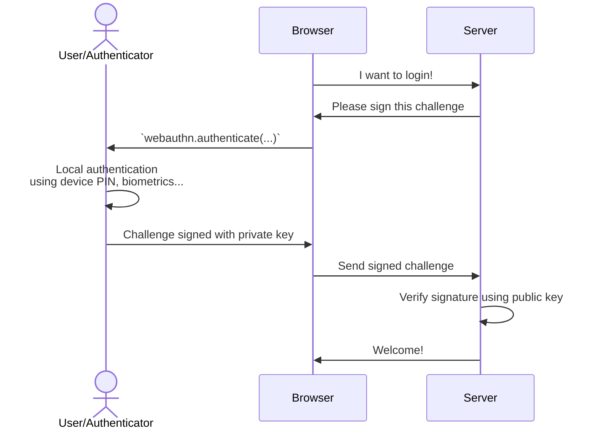

Authentication
==============

Overview
--------

There are actually *three* possible way to trigger authentication.

### Using the platform's passkey selector

This is the default authentication, without any options.

```js
client.authenticate({
  challenge: ...
})
```

It will trigger a native UI, which allows the user to select any "discoverable" passkey registered for that domain.


Above is the windows example. Of course it varies according to the platform.

> Works in most platforms and browsers.


### Invoking authentication with known credential IDs

If you know the credential ID(s), either by polling the server or storing it locally as a "remember me" feature, you can provide it as parameter.

```js
client.authenticate({
  challenge: ...,
  allowCredentials: ['list-of', 'credential-id', 'from-user']
})
```

This way, the passkey selection process is skipped and it goes straight to the user verification or direct authentication, depending on `userVerification` preference and authenticator.


Moreover, another benefit is that non-discoverable credentials can also be used, which is especially handy for security keys.

> Works in most platforms and browsers.


### Using the input autofill feature

...also known as *Conditional UI*.


Unlike the previous methods, which invokes the protocol "directly", this one is triggered during page load.
It activates autocomplete of passkey for input fields having the attribute `autocomplete="username webauthn"`.

```js
client.authenticate({
  challenge: ...,
  conditional: true
})
```

Since there is no way to programmatically know if the user has credentials/passkeys already registered for this domain,
it offers an alternative by skipping the "authenticate" button click. Once selected, the promise will return with the authentication result.

> While this feature is present in Chrome and Safari, it is still very experimental and not available on all browsers.


How does it work
----------------

The authentication procedure is similar to the procedure and divided in four steps.




1. The browser requests a challenge from the server
2. The browser triggers `client.authenticate(...)` and sends the result to the server
3. The server loads the credential key used for authentication
4. The server parses and verifies the authentication payload


1️⃣ Requesting challenge
------------------------

The challenge is basically a [nonce](https://en.wikipedia.org/wiki/nonce) to avoid replay attacks.

```
const challenge = /* request it from server */
```

Remember it on the server side during a certain amount of time and "consume" it once used.

2️⃣ Trigger authentication in browser
-------------------------------------

Example call:

```js
import { client } from '@passwordless-id/webauthn'

const authentication = await client.authenticate({
  /* Required */
  challenge: "A server-side randomly generated string",
  /* Optional */
  allowCredentials: ["credential-id-1", "credential-id-2"],
  timeout: 60000
})
```

Example response:

```json
{
  "credentialId": "3924HhJdJMy_svnUowT8eoXrOOO6NLP8SK85q2RPxdU",
  "authenticatorData": "SZYN5YgOjGh0NBcPZHZgW4_krrmihjLHmVzzuoMdl2MFAAAAAQ==",
  "clientData": "eyJ0eXBlIjoid2ViYXV0aG4uZ2V0IiwiY2hhbGxlbmdlIjoiNTY1MzViMTMtNWQ5My00MTk0LWEyODItZjIzNGMxYzI0NTAwIiwib3JpZ2luIjoiaHR0cDovL2xvY2FsaG9zdDo4MDgwIiwiY3Jvc3NPcmlnaW4iOmZhbHNlLCJvdGhlcl9rZXlzX2Nhbl9iZV9hZGRlZF9oZXJlIjoiZG8gbm90IGNvbXBhcmUgY2xpZW50RGF0YUpTT04gYWdhaW5zdCBhIHRlbXBsYXRlLiBTZWUgaHR0cHM6Ly9nb28uZ2wveWFiUGV4In0=",
  "signature": "MEUCIAqtFVRrn7q9HvJCAsOhE3oKJ-Hb4ISfjABu4lH70MKSAiEA666slmop_oCbmNZdc-QemTv2Rq4g_D7UvIhWT_vVp8M="
}
```


3️⃣ In the server, load the credential key
------------------------------------------

```js
import { server } from '@passwordless-id/webauthn' 

const credentialKey = { // obtained from database by looking up `authentication.credentialId`
    id: "3924HhJdJMy_svnUowT8eoXrOOO6NLP8SK85q2RPxdU",
    publicKey: "MFkwEwYHKoZIzj0CAQYIKoZIzj0DAQcDQgAEgyYqQmUAmDn9J7dR5xl-HlyAA0R2XV5sgQRnSGXbLt_xCrEdD1IVvvkyTmRD16y9p3C2O4PTZ0OF_ZYD2JgTVA==",
    algorithm: "ES256",
    synced: true
} as const

const expected = {
    challenge: "Whatever was randomly generated by the server",
    origin: "http://localhost:8080",
    userVerified: true, // should be set if `userVerification` was set to `required` in the authentication options (default)
    counter: 123 // Optional. You should verify the authenticator "usage" counter increased since last time.
}
```

Regarding the `counter`, it might or might not be implemented by the authenticator.
Typically, it's implemented by hardware-bound keys to detect and avoid the risk of cloning the authenticator and starts with 1 during registration.
On the opposite, for password managers syncing keys in the cloud, the counter is typically always 0 since in that case cloning is a "feature".
For example, device-bound keys on Android and Windows do have an increasing `counter`, USB security keys also, while MacOS/iOS do not.
Lastly, please note that the specs do not mandate "+1" increases, it could theoretically increase by any amount.

Often, it might also be more practical to use functions to verify challenge or origin. This is possible too:

```js
const expected = {
    challenge: async (challenge) => { /* async call to DB for example */ return true },
    origin: (origin) => listOfAllowedOrigins.includes(origin),
    userVerified: true, // no function allowed here
    counter: 123,  // optional, no function allowed here
    verbose: true, // optional, enables debug logs containing sensitive information
}
```

4️⃣ Verify the authentication
-----------------------------

```js
const authenticationParsed = await server.verifyAuthentication(authentication, credentialKey, expected)
```

Either this operation fails and throws an Error, or the verification is successful and returns the parsed authentication payload.

Please note that this parsed result `authenticationParsed` has no real use. It is solely returned for the sake of completeness. The `verifyAuthentication` already verifies the payload, including the signature.


Options
-------

The following options are available for both `register` and `authenticate`.

Besides the required `challenge`, following options are avialable.

| option | default | description |
|--------|---------|-------------|
| `timeout` | 60000 | Number of milliseconds the user has to respond to the biometric/PIN check. *(Default: 60000)*
| `userVerification`| `preferred` | Whether the user verification (using local authentication like fingerprint, PIN, etc.) is `required`, `preferred` or `discouraged`.
| `hints` | `[]` | Which device to use as authenticator, by order of preference. Possible values: `client-device`, `security-key`, `hybrid` (delegate to smartphone).
| `domain` | `window.location.hostname` | By default, the current domain name is used. Also known as "relying party id". You may want to customize it for ...
| `mediation` | | See https://developer.mozilla.org/en-US/docs/Web/API/CredentialsContainer/get#mediation


Remarks
-------

Sadly, there are a few things you cannot do.

- ❌ You cannot know if a user already registered a passkey
- ❌ You cannot decide if the passkey should be hardware-bound or synced
- ❌ You cannot delete a passkey

> *And beware of platform/browser quirks!*

The specification is complex, areas like UX are left to platform's discretion and browser vendors have their own quirks. As such, I would highly recommend one thing: **test it out with a variety of browsers/platforms**. It's far from a consitent experience.

Moreover, otpions like `hints`, `allowCredentials`, `userVerification` and `discoverable` may interact with each other and provide different UX depending on their combination and the time of the year. The protocol evolved dramatically in the last years, with changes to the UX every couple of months.
