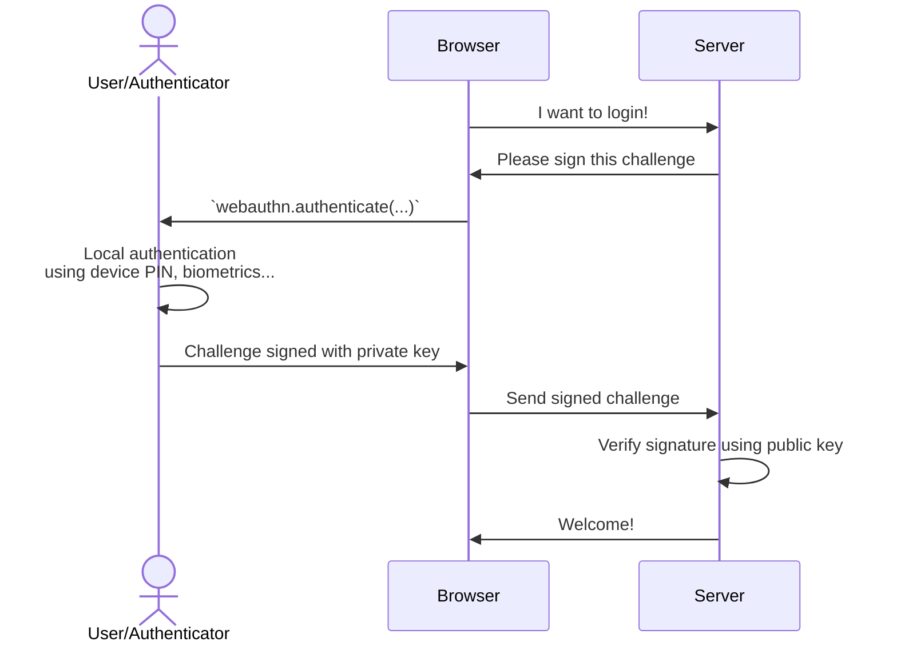

Authentication
==============

Overview
--------

The authentication procedure is similar to the procedure and divided in four steps.




1. The browser requests a challenge from the server
2. The browser triggers `client.authenticate(...)` and sends the result to the server
3. The server loads the credential key used for authentication
4. The server parses and verifies the authentication payload


1️⃣ Requesting a challenge from the server
-----------------------------------------

The challenge is basically a [nonce](https://en.wikipedia.org/wiki/nonce) to avoid replay attacks.
It must be a truly random and non-deterministic byte buffer encoded as *byte64url*.

```js
import { server } from '@passwordless-id/webauthn'

const challenge = server.randomChallenge()
```

Remember it on the server side during a certain amount of time and "consume" it once used.

2️⃣ Trigger authentication in browser
-------------------------------------

Example call:

```js
import { client } from '@passwordless-id/webauthn'

const authentication = await client.authenticate({
  /* Required */
  challenge: "A server-side randomly generated byte array as base64url encoded",
  /* Optional */
  allowCredentials: [{id:'my-credential-id', transports:['internal']}, ...],
  timeout: 60000
})
```

If you already know the supported passkeys for the account, passkey selection can be skipped with `allowCredentials`.
Without, the platform's default passkey slection dialog will be triggered.

The following options are available.

| option | default | description |
|--------|---------|-------------|
| `challenge` | - | Random byte array as *base64url* encoded.
| `timeout` | - | Number of milliseconds the user has to respond to the biometric/PIN check.
| `userVerification`| `preferred` | Whether the user verification (using local authentication like fingerprint, PIN, etc.) is `required`, `preferred` or `discouraged`.
| `hints` | `[]` | Which device to use as authenticator, by order of preference. Possible values: `client-device`, `security-key`, `hybrid` (delegate to smartphone).
| `domain` | `window.location.hostname` | By default, the current domain name is used. Also known as "relying party id". You may want to customize it for ...
| `allowedCredentials` | The list of credentials and the transports it supports. Used to skip passkey selection. Either a list of credential ids (discouraged) or list of credential objects with `id` and supported `transports` (recommended).
| `autocomplete` | `false` | See concepts
| `customProperties` | `{}` | An object of additional properties that will be merged into the WebAuthn authenticate options. This can be used to explicitly set fields such as `extensions`.


3️⃣ Send the payload to the server
---------------------------------

The authentication payload will look like this:

```json
{
  "clientExtensionResults": {},
  "id": "L10e_letUcC5nKayX3rMWN_aBY1pyDQfsPb4Tq_8vIo",
  "rawId": "L10e_letUcC5nKayX3rMWN_aBY1pyDQfsPb4Tq_8vIo=",
  "type": "public-key",
  "authenticatorAttachment": "cross-platform",
  "response": {
    "authenticatorData": "T7IIVvJKaufa_CeBCQrIR3rm4r0HJmAjbMYUxvt8LqAFAAAAAg==",
    "clientDataJSON": "eyJ0eXBlIjoid2ViYXV0aG4uZ2V0IiwiY2hhbGxlbmdlIjoibVRJX1BUNU9NcmlSTWxqNEtZd244NlZ3Iiwib3JpZ2luIjoiaHR0cHM6Ly93ZWJhdXRobi5wYXNzd29yZGxlc3MuaWQiLCJjcm9zc09yaWdpbiI6ZmFsc2UsIm90aGVyX2tleXNfY2FuX2JlX2FkZGVkX2hlcmUiOiJkbyBub3QgY29tcGFyZSBjbGllbnREYXRhSlNPTiBhZ2FpbnN0IGEgdGVtcGxhdGUuIFNlZSBodHRwczovL2dvby5nbC95YWJQZXgifQ==",
    "signature": "MEYCIQC2W8TArZgiDw-D6HM526Dfr5uROPwWaCp7f4Lt-R_UHQIhANVdFi7nmHc_ZtMWLwRTHfT8AQF8ssrUFTcroocPra9B",
    "userHandle": "NGFhNGRmNWYtMTY2Ni00NDAwLWFjYTUtM2I2MjdjYzkwMDhh"
  }
}
```


4️⃣ In the server, load the credential key
------------------------------------------

```js
import { server } from '@passwordless-id/webauthn' 

// obtained from database by looking up `authentication.id`
const credentialKey = { 
    id: "L10e_letUcC5nKayX3rMWN_aBY1pyDQfsPb4Tq_8vIo",
    publicKey: "MFkwEwYHKoZIzj0CAQYIKoZIzj0DAQcDQgAExZ3bQ9Xa4kbrskcobWw8Drr4Facf074_o9GbN_g56L8V2IOeHxBrcNS35XQFD1VoGWiO0Aqx3QnmVst3aCz6rg==",
    algorithm: "ES256",
    transports: ["usb"]
}

const expected = {
    challenge: "mTI_PT5OMriRMlj4KYwn86Vw",
    origin: "https://webauthn.passwordless.id",
    userVerified: true,  // should be set if `userVerification` was set to `required` in the authentication options (default)
    counter: -1
}

const verified = await server.verifyAuthentication(res, credentialKey, expected)
// verified.counter contains a number that the authenticator might increase, use it as `expected.counter` during the next authentication
```

Regarding the `verified.counter`, it's implemented by hardware-bound keys to detect and avoid the risk of cloning the authenticator and starts with 1 during registration.
On the opposite, for password managers syncing keys in the cloud, the counter is typically always 0 since in that case cloning is a "feature".
For example, device-bound keys on Android and Windows do have an increasing `counter`, USB security keys also, while MacOS/iOS do not.
Lastly, please note that the specs do not mandate "+1" increases, it could theoretically increase by any amount.

Often, it might also be more practical to use functions to verify challenge or origin. This is possible too:

```js
const expected = {
    challenge: async (challenge) => { /* async call to DB for example */ return true },
    origin: (origin) => listOfAllowedOrigins.includes(origin),
    userVerified: true, // no function allowed here
    counter: 123,  // optional, no function allowed here
    verbose: true, // optional, enables debug logs containing sensitive information
}
```

5️⃣ Verify the authentication
-----------------------------

```js
const authenticationParsed = await server.verifyAuthentication(authentication, credentialKey, expected)
```

Either this operation fails and throws an Error, or the verification is successful and returns the parsed authentication payload.

Please note that this parsed result `authenticationParsed` has no real use. It is solely returned for the sake of completeness. The `verifyAuthentication` already verifies the payload, including the signature.


Remarks
-------

Sadly, there are a few things you cannot do.

- ❌ You cannot know if a user already registered a passkey
- ❌ You cannot decide if the passkey should be hardware-bound or synced
- ❌ You cannot delete a passkey

> *And beware of platform/browser quirks!*

The specification is complex, areas like UX are left to platform's discretion and browser vendors have their own quirks. As such, I would highly recommend one thing: **test it out with a variety of browsers/platforms**. It's far from a consitent experience.

Moreover, options like `hints`, `allowCredentials`, `userVerification` and `discoverable` may interact with each other and provide different UX depending on their combination and the time of the year. The protocol evolved dramatically in the last years, with changes to the UX every couple of months.
