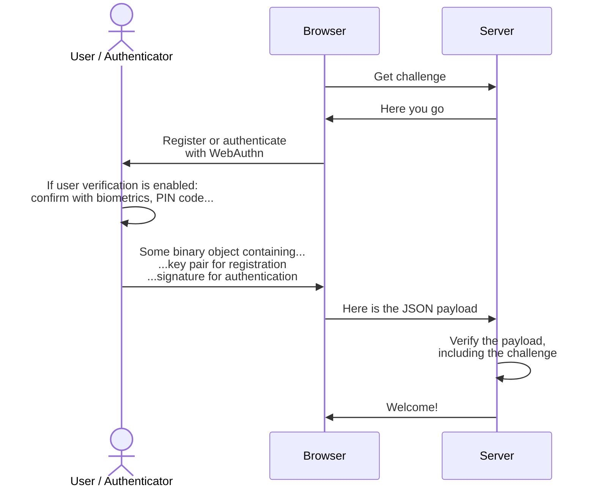
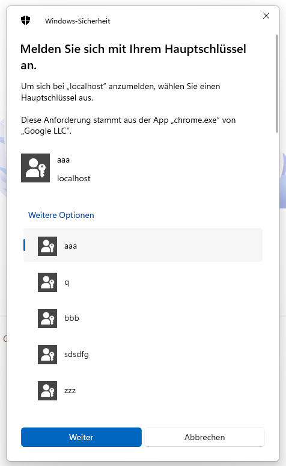
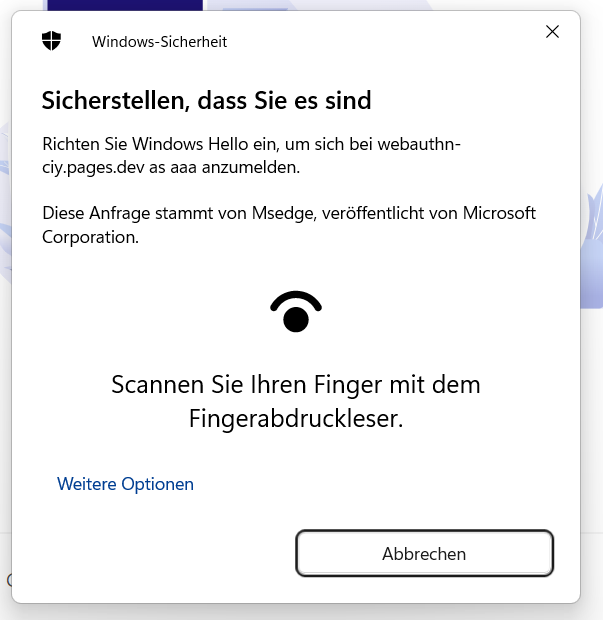
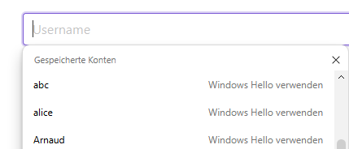

Concepts
========

📖 Fundamentals
----------------

Passkeys and the WebAuthn protocol are not purely client side or server side.
It relies on [asymmetric cryptography](https://en.wikipedia.org/wiki/Public-key_cryptography) involving both sides.

Asymmetric cryptography's foundation is based on a "key pair", but a more suitable layman analogy would be an key and a lock. The private key 🔑 is used to encrypt a message, while the corresponding public key 🔒 is used to decrypt the message.

Upon registration, a cryptographic key pair (🔑+🔒) is created by the authenticator, for the given domain and user. The public key (🔒) is then sent to the server while the private key (🔑) is safely stored by the authenticator. 

> This private key can either be hardware-bound (if a security key is used for example) or synced in the cloud (if a password manager is used for example). It can also require local user verification or not, depending on the authenticator and the options. Check out the [F.A.Q.](/faq) for more information.

During authentication, the authenticator will *sign* a payload using its private key (🔑). Then, the server can verify the signature using the previously stored public key (🔒) and confirm the user is the rightful owner of that key pair.


⛖ Flow
-------

The logical flow which can be summarized as follows.



The challenge must be a "truly" random value (a cryptographic nonce) generated by the server.
This is a cornerstone of the security model, to avoid replay attacks.


👆 User experience
-------------------


There are actually *three* possible way to trigger authentication.

### Using the platform's passkey selector

This is the default authentication, without any options.

```js
client.authenticate({
  challenge: ...
})
```

It will trigger a native UI, which allows the user to select any "discoverable" passkey registered for that domain.



Above is the windows example. Of course it varies according to the platform.

*✅ Works in most platforms and browsers.*


### Invoking authentication with known credential IDs

If you know the credential ID(s), either by polling the server or storing it locally as a "remember me" feature, you can provide it as parameter.

```js
client.authenticate({
  challenge: ...,
  allowCredentials: [{id:'my-credential-id', transports:['internal']}, ...]
})
```

This way, the passkey selection process is skipped and it goes straight to the user verification or direct authentication, depending on `userVerification` preference and authenticator.



Moreover, another benefit is that non-discoverable credentials can also be used, which is especially handy for security keys.

*✅ Works in most platforms and browsers.*


### Using the input autocomplete feature

...also known as *Conditional mediation*.



Unlike the previous methods, which invokes the protocol "directly", this one is triggered during page load.
It activates autocomplete of passkey for input fields having the attribute `autocomplete="username webauthn"`.

```js
client.authenticate({
  challenge: ...,
  autocomplete: true
})
```

Since there is no way to programmatically know if the user has credentials/passkeys already registered for this domain,
it offers an alternative by skipping the "authenticate" button click. Once selected, the promise will return with the authentication result.
Calling the registration or authentication afterwards will abord the previous pending one.

*⚠️ While this feature is present in Chrome and Safari, it is still very experimental and not available on all browsers.*

Therefore, the usage of `await client.isAutocompleteAvailable()` is advised.


🛡️ Security considerations
---------------------------

> For a better understanding of "public key credentials", we recommend reading the [F.A.Q.](/faq) first.

### The `challenge` is crucial!

It must be:

- "truly" *randomly generated on each call*. 
- "consumed" upon use
- "expire" if unused (after a few minutes for example)

This is very important to ensure protection against replay attacks. Such an attack consists of eavesdropping the authentication payload somehow, and reusing it again in an attempt to re-authenticate the user that way.
 
By verifying server-side, that the signed authentication payload contains the freshly generated challenge, it ensures a copied and reused payload will not work since the challenge.


### Device-bound vs synced

Whether "platform" passkeys are stored on the device's hardware or "synced" to the platform's user account.
While device-bound keys offer a higher security level, synced software-based keys are more convinient.

| Platform | Hardware-bound | Synced |
|----------|--------------------|---------------|
| Android  | ❌                  | ✅              |
| iOS      | ❌                  | ✅             |
| Linux    | ?                  | ?             |
| macOS    | ❌                  | ✅             |
| Security keys | ✅              | ❌             |
| Password managers | ❌           | ✅             |
| Windows  | ✅[1]               | ✅[1]             |

*Notes:*

[1] Might vary depending on Windows version, Browser and options.
I'm not quite sure of all factors that might affect this, but I had both kind of keys in Windows. 


🪳 Compatibility and bugs
-------------------------

> While passkeys roughly works well, there are some combinations of platforms, browsers, authenticators and features which do not.
>
> Take into account that this might change at any time and contain outdated information. If so, please contact us to rectify it.


### Non-compliant password managers

The following list of passkey providers have a wrong *User Verification* behavior.

| Provider	| Architecture (\*)	| UV Required Behavior |	UV Flag |
|-----------|-------------------|--------------------|---------|
| 1Password   |	Extension	| ❌ Handles request without UV	| ❌ Always replies True
| 1Password	  | Native	  | ✅ Performs UV	                | ✅ UV flag accurate
| Bitwarden	  | Extension	| ❌ Handles request without UV	| ❌ Always replies True
| KeepassXC	  | Extension	| ❌ Handles request without UV	| ❌ Always replies True
| Proton Pass	| Extension	| ❌ Handles request without UV	| ❌ Always replies True
| Proton Pass	| Native	  | ❌ Handles request without UV	| ❌ Always replies True
| Strongbox	  | Native    | ❌ Handles request without UV	| ❌ Always replies True

*Source: [passkeys.dev known issues](https://passkeys.dev/docs/reference/known-issues/)*

(\*) Architecture: *Extension* = web browser extension, *Native* = OS native app using provider APIs


### Local / roaming authenticators

Whether the platform can create or use a Passkey using the local device or a roaming device.

| Platform | Local authenticator | Roaming authenticator |
|---------|---------------------|-----------------------|
| Android | ✅                   | ❌                     |
| iOS     | ✅                   | ✅                     |
| Linux   | ?                   | ?                     |
| macOS   | ✅                   | ✅                     |
| Windows | ✅[1]                | ✅                     |

*Notes:*

[1] Not supported on all browsers, for example FireFox can only use security keys.


### autocomplete with "conditional mediation"

- ✅ Chrome
- ✅/❌ Edge: kind of buggy!
- ❌ Firefox
- ? Safari

> The website https://passkeys.dev/device-support/ offers different results, however my personal experience begs to differ.


### `toJSON()` support

- ❌ Chrome
- ❌ Edge
- ✅ Firefox
- ❌ Safari


