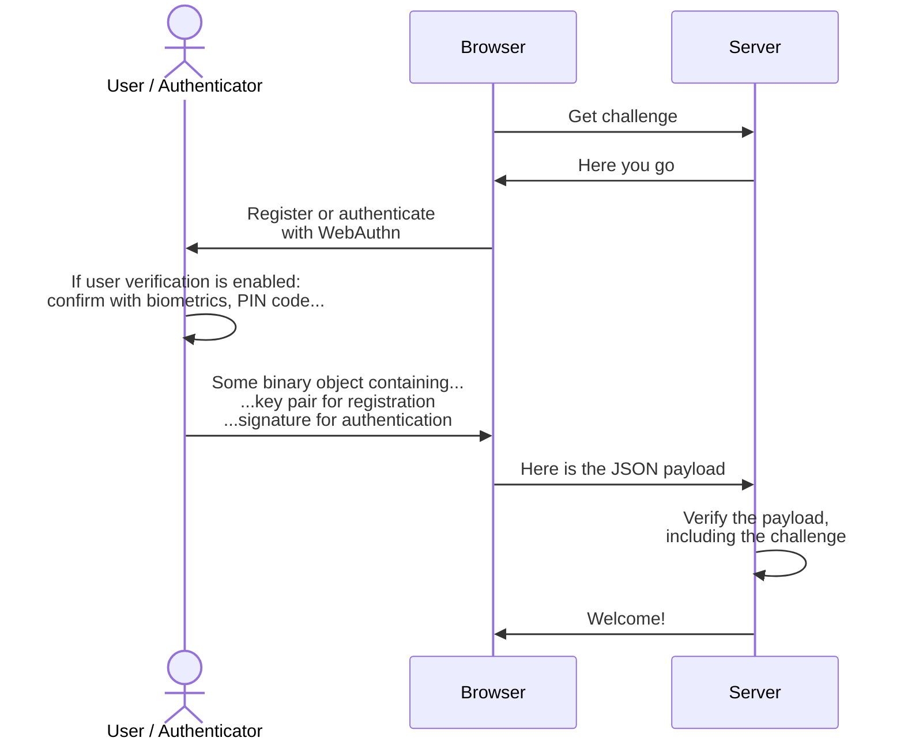

Concepts
========

📖 Fundamentals
----------------

Passkeys and the WebAuthn protocol are not purely client side or server side.
It relies on [asymmetric cryptography](https://en.wikipedia.org/wiki/Public-key_cryptography) involving both sides.

Asymmetric cryptography's foundation is based on a "key pair", but a more suitable layman analogy would be an key and a lock. The private key 🔑 is used to encrypt a message, while the corresponding public key 🔒 is used to decrypt the message.

Upon registration, a cryptographic key pair (🔑+🔒) is created by the authenticator, for the given domain and user. The public key (🔒) is then sent to the server while the private key (🔑) is safely stored by the authenticator. 

> This private key can either be hardware-bound (if a security key is used for example) or synced in the cloud (if a password manager is used for example). It can also require local user verification or not, depending on the authenticator and the options. Check out the [F.A.Q.](/faq) for more information.

During authentication, the server will request that the authenticator *signs* a "challenge" (a nonce) using its private key (🔑). Then, the server can verify the signature using the previously stored public key (🔒) and confirm the user is the rightful owner of that key pair.

⛖ Flow
-------

The logical flow which can be summarized as follows.

🛡️ Security considerations
---------------------------

### Phishing resistant

*Passkeys are bound to the domain they were registered for*. In other words, if you registered your passkey for `good-company.com`, it will only be usable for this domain.
It cannot be used for `attacker.xyz` for example.

### The `challenge` is crucial !!!

It must be:

- "truly" *randomly generated on each call*. 
- "consumed" upon use
- "expire" if unused (after a few minutes for example)

> This is very important to ensure protection against replay attacks. Such an attack consists of eavesdropping the authentication payload somehow, and reusing it again in an attempt to re-authenticate the user that way.
> 
> By verifying server-side, that the signed authentication payload contains the freshly generated challenge, it ensures a copied and reused payload will not work since the challenge.

### Hardware vs Software authenticators

TODO

🪳 Passkeys quirks
-------------------

> While passkeys roughly works well, there are some combinations of platforms, browsers, authenticators and features which do not.
>
> Take into account that this might change at any time and contain outdated information. If so, please contact us to rectify it.

### Password managers vs User verification

The following list of passkey providers have not implemented *User Verification* in a spec-compliant manner.

| Provider	| Architecture (\*)	| UV Required Behavior |	UV Flag |
|-----------|-------------------|--------------------|---------|
| 1Password   |	Extension	| ❌ Handles request without UV	| ❌ Always replies True
| 1Password	  | Native	  | ✅ Performs UV	                | ✅ UV flag accurate
| Bitwarden	  | Extension	| ❌ Handles request without UV	| ❌ Always replies True
| KeepassXC	  | Extension	| ❌ Handles request without UV	| ❌ Always replies True
| Proton Pass	| Extension	| ❌ Handles request without UV	| ❌ Always replies True
| Proton Pass	| Native	  | ❌ Handles request without UV	| ❌ Always replies True
| Strongbox	  | Native    | ❌ Handles request without UV	| ❌ Always replies True

*Source: [passkeys.dev known issues](https://passkeys.dev/docs/reference/known-issues/)*

(\*) Architecture: *Extension* = web browser extension, *Native* = OS native app using provider APIs

### Hardware-bound vs software-bound

- Android: Software-only
- iOS: Software-only
- Linux: Hardware-only
- Windows: Depends on `discoverable` parameter

### Autofill / conditional-UI

- ✅ Chrome
- ✅/❌ Edge: kind of buggy
- ❌ Firefox
- ? Safari

> The website https://passkeys.dev/device-support/ offers different results, however my personal experience begs to differ.

### `toJSON()` support

- ❌ Chrome
- ❌ Edge
- ✅ Firefox
- ❌ Safari

---

> TODO

### Request roaming authenticator

Is it possible to request authentication via USB key or another phone for example?

- Android: 
- iOS: 
- Linux: 
- Windows: 

