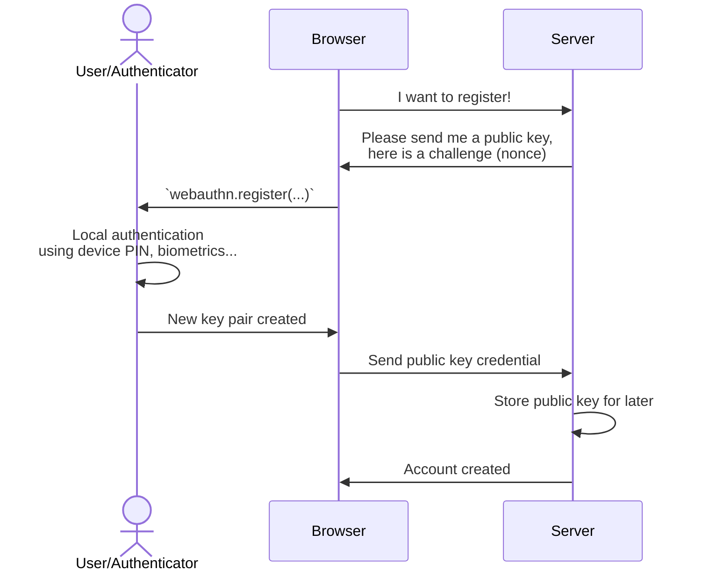

Registration
------------

### Overview


The registration process occurs in four steps:

1. The browser requests a `challenge` (a nonce) from the server
2. The browser triggers `client.register(...)` and sends the result to the server
3. The server parses the JSON payload, verifies it, and ensures the `challenge` matches
4. The server stores the public key credential for this device for the user account


Note that unlike traditional authentication, the credential key is attached to the device. Therefore, it might make sense for a single user account to have multiple credential keys.


### 1. Requesting challenge

The challenge is basically a [nonce](https://en.wikipedia.org/wiki/nonce) to avoid replay attacks.

```
const challenge = /* request it from server */
```

Remember it on the server side during a certain amount of time and "consume" it once used.

### 2. Trigger registration in browser

Example call:

```js
import { client } from '@passwordless-id/webauthn' 

const registration = await client.register({
  /* required */
  user: "Arnaud Dagnelies",
  challenge: "A server-side randomly generated string",
  /* optional */
  authenticatorType: "auto",
  userVerification: "required",
  timeout: 60000,
  attestation: true,
  debug: false
})
```

Besides the required `user` and `challenge`, it has following options.

| option | default | description |
|--------|---------|-------------|
| allowPlatform | `true` | Allow the platform to be used as authenticator. |
| allowRoaming | `true` | Allow roaming authenticators to be used. Including QR codes to scan. |
| userVerification | `required` | Whether the user verification (using local authentication like fingerprint, PIN, etc.) is `required`, `preferred` or `discouraged`. Note that this differs from the native WebAuthn protocol, whose default is `preferred`. Note that some security keys are not capable of user verification.
| timeout | `60000` |  How long the native authentication popup stays open before aborting the authentication process.
| attestation | `true` | Whether or not to provide "attestation" in the result. The attestation can be used to prove the authenticator device model's authenticity. Note that not all authenticators provide this (looking at you apple) and its verification is complex.
| domain | `window.location.hostname` | This can be overriden for two use-cases. By using the parent domain, to have the passkey valid for all subdomains. Or by using the outer domain when using iframes. 
| debug | `false` | If true, the parsed payloads will be included in the result.


### 3. Send the payload to the server

> By default, the native WebAuthn protocol does not result in a serializable object. The protocol in its third iteration provided a `toJSON()` function but its support is not widespread. Moreover, decoding this response would still need decoding CBOR server-side.
>
> Because of this, this library decided to return a more convinient format instead. Plain JSON not requiring CBOR libraries server-side.

The result `registration` object looks like this:

```json
{
  "user": {
    "id": "7f26f9ab-4fbc-4103-807f-ed145acb7ecc",
    "name": "Arnaud",
    "displayName": "Arnaud"
  },
  "credential": {
    "id": "3924HhJdJMy_svnUowT8eoXrOOO6NLP8SK85q2RPxdU",
    "publicKey": "MFkwEwYHKoZIzj0CAQYIKoZIzj0DAQcDQgAEgyYqQmUAmDn9J7dR5xl-HlyAA0R2XV5sgQRnSGXbLt_xCrEdD1IVvvkyTmRD16y9p3C2O4PTZ0OF_ZYD2JgTVA==",
    "algorithm": "ES256"
  },
  "authenticatorData": "SZYN5YgOjGh0NBcPZHZgW4_krrmihjLHmVzzuoMdl2NFAAAAAAiYcFjK3EuBtuEw3lDcvpYAIN_duB4SXSTMv7L51KME_HqF6zjjujSz_EivOatkT8XVpQECAyYgASFYIIMmKkJlAJg5_Se3UecZfh5cgANEdl1ebIEEZ0hl2y7fIlgg8QqxHQ9SFb75Mk5kQ9esvadwtjuD02dDhf2WA9iYE1Q=",
  "clientData": "eyJ0eXBlIjoid2ViYXV0aG4uY3JlYXRlIiwiY2hhbGxlbmdlIjoiYTdjNjFlZjktZGMyMy00ODA2LWI0ODYtMjQyODkzOGE1NDdlIiwib3JpZ2luIjoiaHR0cDovL2xvY2FsaG9zdDo4MDgwIiwiY3Jvc3NPcmlnaW4iOmZhbHNlfQ=="
}
```

Then simply send this object as JSON to the server.

### 3. Verify it server side


```js
import { server } from '@passwordless-id/webauthn' 

const expected = {
    challenge: "Whatever was randomly generated by the server",
    origin: "http://localhost:8080",
}
const registrationParsed = await server.verifyRegistration(registration, expected)
```

Either this operation fails and throws an Error, or the verification is successful and returns the parsed registration.
Example result:

```json
{
  "user": {
    "id": "7f26f9ab-4fbc-4103-807f-ed145acb7ecc",
    "name": "Arnaud",
    "displayName": "Arnaud"
  },
  "credential": {
    "id": "3924HhJdJMy_svnUowT8eoXrOOO6NLP8SK85q2RPxdU",
    "publicKey": "MFkwEwYHKoZIzj0CAQYIKoZIzj0DAQcDQgAEgyYqQmUAmDn9J7dR5xl-HlyAA0R2XV5sgQRnSGXbLt_xCrEdD1IVvvkyTmRD16y9p3C2O4PTZ0OF_ZYD2JgTVA==",
    "algorithm": "ES256",
    "synced": true
  },
  "authenticator": {
    ...
    "name": "Windows Hello",
    "icon_dark": "https://webauthn.passwordless.id/authenticators/08987058-cadc-4b81-b6e1-30de50dcbe96-dark.png",
    "icon_light": "https://webauthn.passwordless.id/authenticators/08987058-cadc-4b81-b6e1-30de50dcbe96-light.png"
  },
  ...
}
```

The credential's `synced` variable indicates if the corresponding *private key* is a "multi-device" key, typically synced in the cloud, or a "device-bound" key, typically stored on a dedicated hardware chip.


> **NOTE:** Currently, the *attestation* which proves the exact model type of the authenticator is *not verified*. [Do I need attestation?](https://medium.com/webauthnworks/webauthn-fido2-demystifying-attestation-and-mds-efc3b3cb3651)

### 4. Store the credential key

The credential key is the most important part and should be stored in a database for later since it will be used to verify the authentication signature.

```json
"credential": {
  "id": "3924HhJdJMy_svnUowT8eoXrOOO6NLP8SK85q2RPxdU",
  "publicKey": "MFkwEwYHKoZIzj0CAQYIKoZIzj0DAQcDQgAEgyYqQmUAmDn9J7dR5xl-HlyAA0R2XV5sgQRnSGXbLt_xCrEdD1IVvvkyTmRD16y9p3C2O4PTZ0OF_ZYD2JgTVA==",
  "algorithm": "ES256",
  "synced": true
},
```

*Please note that unlike traditional systems, you might allow a user to have multiple credential keys.
For example, if you allow the user to use multiple device-bound keys and/or registering keys for multiple platforms.*


Common options
--------------

The following options are available for both `register` and `authenticate`.

- `timeout`: Number of milliseconds the user has to respond to the biometric/PIN check. *(Default: 60000)*
- `userVerification`: Whether to prompt for biometric/PIN check or not. *(Default: "required")*
- `authenticatorType`: Which device to use as authenticator. Possible values:
    - `'auto'`: if the local device can be used as authenticator it will be preferred. Otherwise it will prompt for a roaming device. *(Default)*
    - `'local'`: use the local device (using TouchID, FaceID, Windows Hello or PIN)
    - `'roaming'`: use a roaming device (security key or connected phone)
    - `'both'`: prompt the user to choose between local or roaming device. The UI and user interaction in this case is platform specific.
- `domain`: by default, the current domain name is used. Also known as "relying party id". You may want to customize it for ...
   - a parent domain to let the credential work on all subdomains
   - browser extensions requiring specific IDs instead of domains ?
   - specific iframes use cases?
- `debug`: If enabled, parses the "data" objects and provide it in a "debug" properties.


Registration options
--------------------

- `discoverable`: (`'discouraged'`, `'preferred'` or `'required'`) If the credential is "discoverable", it can be selected using `authenticate` without providing credential IDs. In that case, a native pop-up will appear for user selection. This may have an impact on the "passkeys" user experience and syncing behavior of the key. *(Default: 'preferred')*
- `attestation`: If enabled, the device attestation and clientData will be provided as base64 encoded binary data. Note that this may impact the authenticator information available or the UX depending on the platform. *(Default: false)* 


### Replacing a credential or updating the user name

Regarding the `user`, you can either provide a name as string, or an object like `{id: '...', name: '...', displayName: '...'}`. By default, `name` and `displayName` will be the same. The `id` should not disclose personal information as it can be exposed. Providing the ID can be used to override a credential with a new one, including an updated `name`/`username`.
