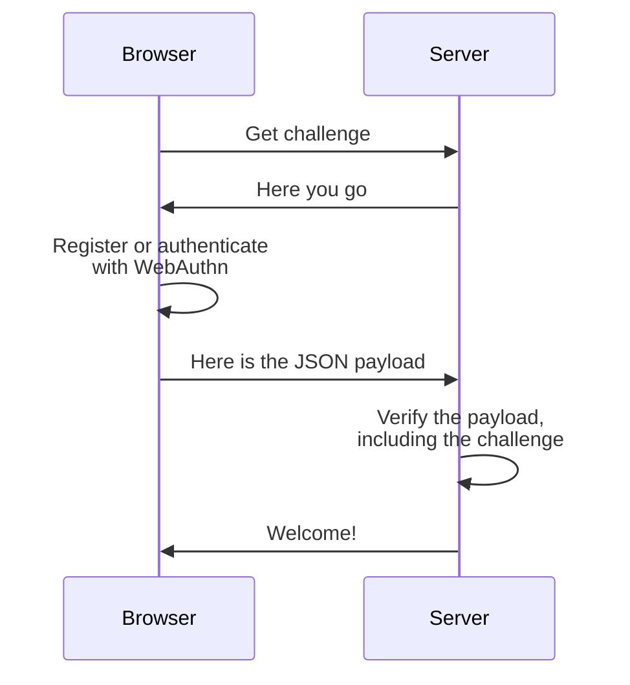

@passwordless-id/webauthn
=========================


<center style="margin:-3rem 0 4rem;">
<a href="/demos/basic.html" class="btn btn-primary btn-lg mx-3 px-5">&#x27A4; Demo</a>
<a href="/demos/playground.html" class="btn btn-primary btn-lg mx-3 px-4">&#x27A4; Playground</a>
</center>

> This library is a greatly simplified and opinionated wrapper to invoke the [webauthn protocol](https://w3c.github.io/webauthn/) more conveniently.
It is an [open source](https://github.com/passwordless-id/webauthn), dependency-free and minimalistic library (17kb only, from which 11kb is the list of authenticator AAGUIDs/names).
>
> This library is used in [Passwordless.ID](https://passwordless.id), a free public identity provider using Passkeys as core pillar.


👀 Demos
---------

- [Basic Demo](/demos/basic.html)
- [Conditional UI](/demos/conditional-ui.html)
- [Testing Playground](/demos/playground.html)
- [Authenticators list](/demos/authenticators.html)
- Parser/Verifier: TODO
  
These demos are plain HTML/JS, not minimized. Just open the sources in your browser if you are curious.


💡 Concepts
------------

Passkeys and the WebAuthn protocol are not purely client side or server side.
It relies on [asymmetric cryptography](https://en.wikipedia.org/wiki/Public-key_cryptography) involving both sides.

Asymmetric cryptography's foundation is based on a "key pair", but a more suitable layman analogy would be an key and a lock. The private key 🔑 is used to encrypt a message, while the corresponding public key 🔒 is used to decrypt the message.

Upon registration, a cryptographic key pair (🔑+🔒) is created by the authenticator, for the given domain and user. The public key (🔒) is then sent to the server while the private key (🔑) is safely stored by the authenticator. 

> This private key can either be hardware-bound (if a security key is used for example) or synced in the cloud (if a password manager is used for example). It can also require local user verification or not, depending on the authenticator and the options. Check out the [F.A.Q.](/faq) for more information.

During authentication, the server will request that the authenticator *signs* a "challenge" (a nonce) using its private key (🔑). Then, the server can verify the signature using the previously stored public key (🔒) and confirm the user is the rightful owner of that key pair.

The logical flow which can be summarized as follows.



> **Security tip**
> 
> The `challenge` *must be randomly generated* on each call.
> Using a constant challenge would make authentication vulnerable to replay attacks.
> Guessable challenges, while harder to exploit, would still weaken the security properties of the algorithm.


📦 Installation
----------------

**Modules**

```bash
npm install @passwordless-id/webauthn
```

The base package contains both client and server side modules. You can import the `client` submodule or the `server` depending on your need.

```js
import {client} from '@passwordless-id/webauthn'
import {server} from '@passwordless-id/webauthn'
```

*Note: the brackets in the import are important!*

**Browser**

Alternatively, the client-side can be imported directly imported in a static page as a `webauthnClient` browser global.

```html
<script src="https://unpkg.com/@passwordless-id/webauthn@1.6.1/dist/browser/webauthn.min.js"></script>
```

**CommonJS**

Lastly, a CommonJS variant is also available for old Node stacks. It's usage is discouraged though, in favor of the default ES modules.

Note that at least NodeJS **19+** is necessary. For older Node versions, take a look at [Arch0125's fork](https://github.com/Arch0125/webauthn/tree/nodev14-v16-support). (The reason of the Node 19+ compatibility is basically `WebCrypto` being globally available, making it possible to have a "universal build")


🚀 Getting started
-------------------

There are multiple ways to use and invoke the WebAuthn protocol.
What follows is just an example of the most straightforward use case. 

### Registration

```
import {client} from '@passwordless-id/webauthn'
await client.register({
  challenge: 'a random string generated by the server',
  user: 'John Doe'
})
```

[&rarr; Registration docs](/registration/)


### Authentication

```
import {client} from '@passwordless-id/webauthn'
await client.authenticate({
  challenge: 'a random string generated by the server'
})
```

[&rarr; Authentication docs](/authentication/)


### Verification

```
import {server} from '@passwordless-id/webauthn'
await server.verifyRegistration(registration, expected)
await server.verifyAuthentication(registration, expected)
```

[&rarr; Verification docs](/verification/)


📃 Changelog
-------------

> The "Version 2" is a complete overhaul of the first version.
> While it still strives for simplicity and ease of use, it also differs from the previous mainly regarding its default behavior.
>
> Previously, this lib defaulted to using the platform as authenticator if possible.
> The user experience was improved that way, going straight to user verification instead of intermediate popup(s) to select the authenticator.
> 
> Now, letting the user select the authenticator is the default.
> Why this change of mind? Because many platform authenticators now sync credentials in the cloud, with the built-in password manager.
> While this is certainly convenient, the security and privacy guarantees using synced credentials are not as strong as when using security keys with hardware-bound credentials.
> That is why security keys now deserve some love.
>
> Same goes for user verification, it is now `preferred`, like the native WebAuthn protocol.
> While this reduces security, it supports a wider range of security keys.
>
> Lastly, the response format has been changed completely to be compatible with the output as the `PublicKeyCredential.toJson()` method. Currently only FireFox implements this method though. We hope this will increase compatibility cross-libraries in the long term.

- Use platform authenticator by default => authenticator selection pops up by default
- `authenticatorType` was removed => use `hints` instead
- User verification default: `required` => `preferred`
- Timeout: 1 minute => no timeout
- Response format changed
- Transports as part of `allowCredentials`

The docs for the legacy version 1.x are found [here](/version-1)