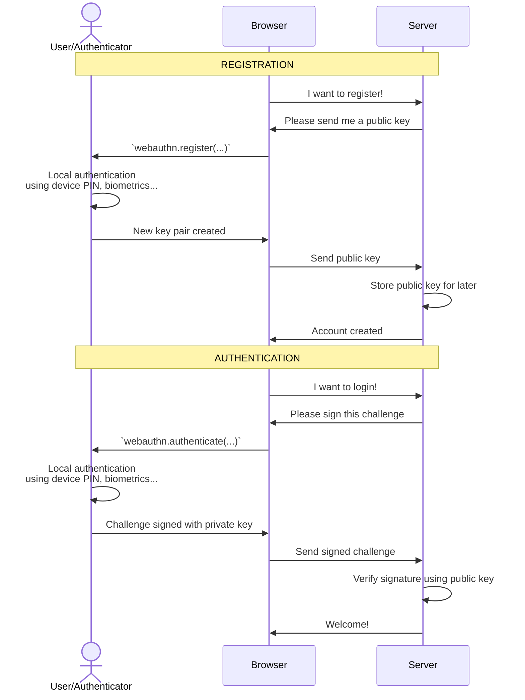

Introduction
------------

This library is a greatly simplified and opinionated wrapper to invoke the [webauthn protocol](https://w3c.github.io/webauthn/) more conveniently.
It is an [open source](https://github.com/passwordless-id/webauthn), dependency-free and minimalistic library (17kb only, from which 11kb is the list of authenticator aaguids/names).

> This library is used in [Passwordless.ID](https://passwordless.id), a free public identity provider based on WebAuthn.

Demos
-----

Try out the playground to see how this library works:

### *[Testing Playground](https://webauthn.passwordless.id/demos/playground.html)*

Other demos with minial examples:

- [Basic Demo](https://webauthn.passwordless.id/demos/basic.html)
- [Minimal Example (CDN)](https://webauthn.passwordless.id/demos/example-cdn.html)
- [Minimal Example (repository)](https://webauthn.passwordless.id/demos/example-raw.html)
- [Authenticators list](https://webauthn.passwordless.id/demos/authenticators.html)

The source of all demos is on [GitHub](https://github.com/passwordless-id/webauthn)


Installation / Usage
--------------------

### NPM

```bash
npm install @passwordless-id/webauthn
```

```js
import * as webauthn from '@passwordless-id/webauthn'
```

### Browser

```html
<script type="module">
  import { client } from 'https://unpkg.com/@passwordless-id/webauthn@1.6.1/dist/webauthn.min.js'
</script>
```
### Import

The `webauthn` module is basically a "bundle" composed of the following modules:

- `client`: used for invoking webauthn in the browser
- `server`: used for verifying responses in the server
- `parsers`: used to parse part or all of the encoded data without verifications
- `utils`: various encoding, decoding, challenge generator and other utils

It was designed that way so that you can import only the module(s) you need. That way, the size of your final js bundle is reduced even further. Importing all is dependency free and < 10kb anyway.

So you might for example `import { client } from '@passwordless-id/webauthn'` for browser side stuff and `import { server } from '@passwordless-id/webauthn'` for server side stuff.

### Runs in...

- In Chrome, Edge, Firefox, Safari
- NodeJS **19+** (*)
- Cloudflare Workers
- Probably in most recent browsers/servers

(*) For older Node versions, take a look at [Arch0125's fork](https://github.com/Arch0125/webauthn/tree/nodev14-v16-support). (The reason of the Node 19+ compatibility is basically `WebCrypto` being globally available, making it possible to use the same build for all targets: browser, node, clouflare workers...)


Getting started
---------------

In a very simplified way, here is how Passkeys / WebAuthn works.




Further documentation about the protocol can be found in the webauthn guide at [Passwordless.ID](https://passwordless.id).

