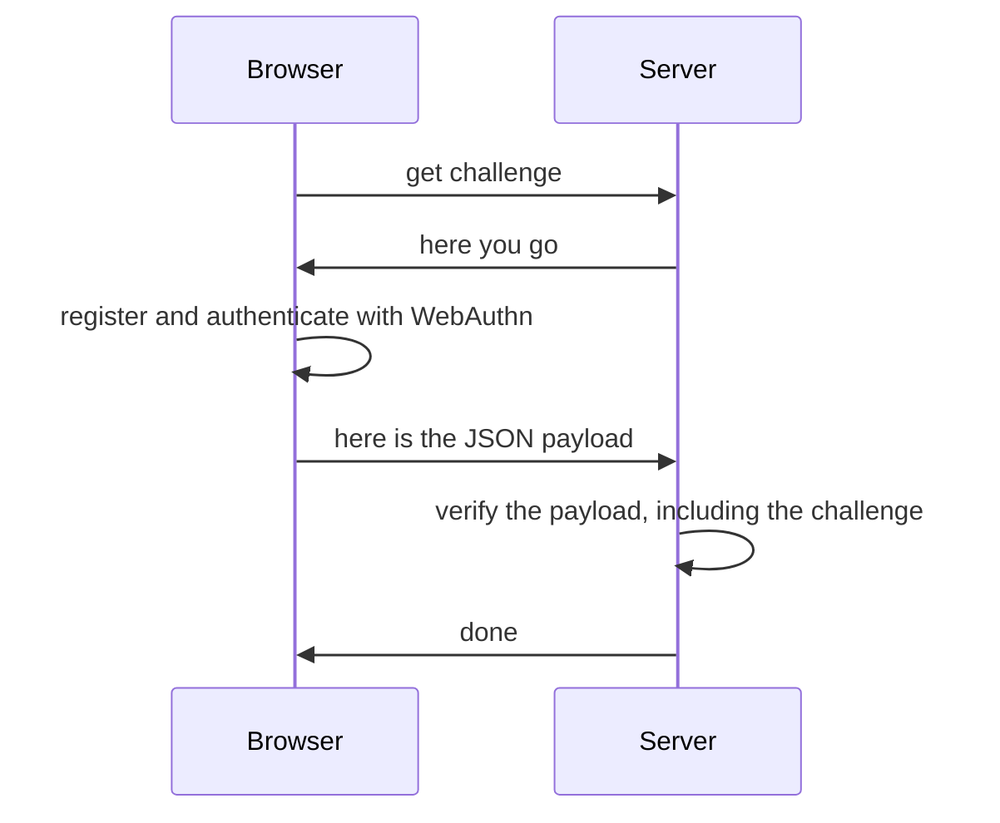

@passwordless-id/webauthn
=========================


<center style="margin:-3rem 0 4rem;">
<a href="/demos/basic.html" class="btn btn-primary btn-lg mx-3 px-5">&#x27A4; Demo</a>
<a href="/demos/basic.html" class="btn btn-primary btn-lg mx-3 px-4">&#x27A4; Playground</a>
</center>

> This library is a greatly simplified and opinionated wrapper to invoke the [webauthn protocol](https://w3c.github.io/webauthn/) more conveniently.
It is an [open source](https://github.com/passwordless-id/webauthn), dependency-free and minimalistic library (17kb only, from which 11kb is the list of authenticator aaguids/names).
>
> This library is used in [Passwordless.ID](https://passwordless.id), a free public identity provider using Passkeys as core pillar.


News
-------

The docs for the legacy version 1.x are found [here](/version-1)

👀 Demos
---------

- [**Basic Demo**](/demos/basic.html)
- [**Testing Playground**](/demos/playground.html)
- [**Authenticators list**](/demos/authenticators.html)
- [**Passkeys autofill**](/demos/conditional-ui.html)

The source of all demos is on [GitHub](https://github.com/passwordless-id/webauthn/)


📦 Installation
----------------

**Modules**

```bash
npm install @passwordless-id/webauthn
```

The base package contains both client and server side modules. You can import the `client` submodule or the `server` depending on your need.

```js
import {client} from '@passwordless-id/webauthn'
import {server} from '@passwordless-id/webauthn'
```

*Note: the brackets in the import are important!*

**Browser**

Alternatively, the client-side can be imported directly imported in a static page as a `webauthnClient` browser global.

```html
<script src="https://unpkg.com/@passwordless-id/webauthn@1.6.1/dist/browser/webauthn.min.js"></script>
```

**CommonJS**

Lastly, a CommonJS variant is also available for old Node stacks. It's usage is discouraged though, in favor of the default ES modules.

Note that at least NodeJS **19+** is necessary. For older Node versions, take a look at [Arch0125's fork](https://github.com/Arch0125/webauthn/tree/nodev14-v16-support). (The reason of the Node 19+ compatibility is basically `WebCrypto` being globally available, making it possible to have a "universal build")


💡 Concepts
------------

Passkeys and the WebAuthn protocol are not purely client side or server side. Both sides are involved.
As such, it is important to understand the logical flow which can be summarized as follows.



> **Security tip**
> 
> The `challenge` *must be randomly generated* on each call.
> Using a constant challenge would make authentication vulnerable to replay attacks.
> Guessable challenges, while harder to exploit, would still weaken the security properties of the algorithm.


🚀 Getting started
-------------------

There are multiple ways to use and invoke the WebAuthn protocol.
What follows is just an example of the most straightforward use case. 

### Registration

```
import {client} from '@passwordless-id/webauthn'
await client.register({
  challenge: 'a random string generated by the server',
  user: 'John Doe'
})
```

[&rarr; Registration docs](/registration/)


### Authentication

```
import {client} from '@passwordless-id/webauthn'
await client.authenticate({
  challenge: 'a random string generated by the server'
})
```

[&rarr; Authentication docs](/authentication/)


### Verification

```
import {server} from '@passwordless-id/webauthn'
await server.verifyRegistration(registration, expected)
await server.verifyAuthentication(registration, expected)
```

[&rarr; Verification docs](/verification/)

