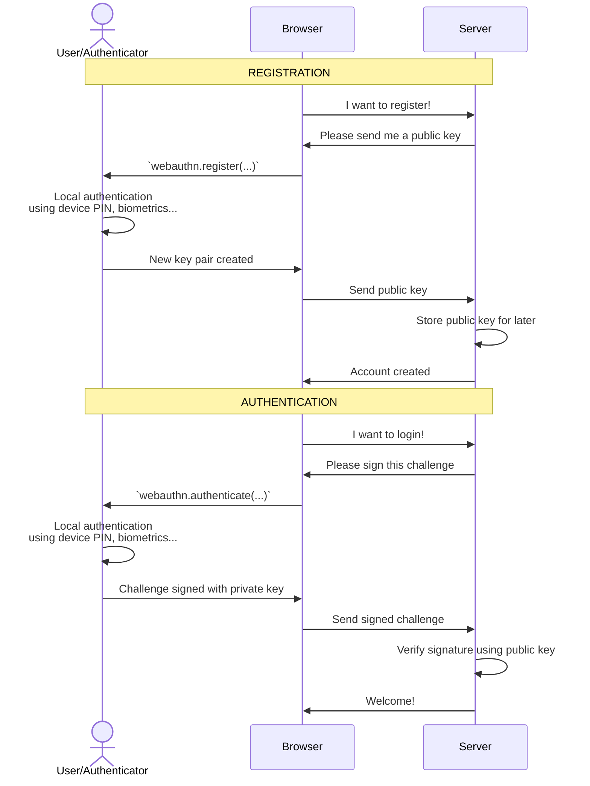

@passwordless-id/webauthn
=========================


> This library is a greatly simplified and opinionated wrapper to invoke the [webauthn protocol](https://w3c.github.io/webauthn/) more conveniently.
It is an [open source](https://github.com/passwordless-id/webauthn), dependency-free and minimalistic library (17kb only, from which 11kb is the list of authenticator aaguids/names).
>
> This library is used in [Passwordless.ID](https://passwordless.id), a free public identity provider using Passkeys as core pillar.

Demos
-----

- [Basic Demo](https://webauthn.passwordless.id/demos/basic.html)
- [Testing Playground](https://webauthn.passwordless.id/demos/playground.html)
- [Authenticators list](https://webauthn.passwordless.id/demos/authenticators.html)
- [Passkeys autofill](https://webauthn.passwordless.id/demos/authenticators.html)

The source of all demos is on [GitHub](https://github.com/passwordless-id/webauthn/)


Installation / Usage
--------------------

### NPM

The base package is suited for both client and server side.

```bash
npm install @passwordless-id/webauthn
```

The `webauthn` module is basically a "bundle" composed of the following submodules:

- `client`: used for invoking webauthn in the browser
- `server`: used for verifying responses in the server
- `parsers`: used to parse part or all of the encoded data without verifications
- `utils`: various encoding, decoding, challenge generator and other utils

It was designed that way so that you can import only the module(s) you need. That way, the size of your final js bundle is reduced even further. Importing all is dependency free and < 10kb anyway.

So you might for example import only the `client` submodule or the `server` only for server side stuff.

```js
import {client} from '@passwordless-id/webauthn'
import {server} from '@passwordless-id/webauthn'
```

*Note: the brackets in the import are important!*


### Browser

Alternatively, the client-side can be imported directly imported in a static page as a `webauthnClient` browser global.

```html
<script src="https://unpkg.com/@passwordless-id/webauthn@1.6.1/dist/browser/webauthn.min.js"></script>
```

### CommonJS

Lastly, a CommonJS variant is also available for old Node stacks. It's usage is discouraged though, in favor of the default ES modules.

Note that at least NodeJS **19+** is necessary. For older Node versions, take a look at [Arch0125's fork](https://github.com/Arch0125/webauthn/tree/nodev14-v16-support). (The reason of the Node 19+ compatibility is basically `WebCrypto` being globally available, making it possible to have a "universal build")


Getting started
---------------

### Registration


```
await client.register({
  challenge: 'a random string generated by the server',
  user: 'John Doe'
})
```

### Authentication

```
await client.authenticate({
  challenge: 'a random string generated by the server'
})
```

### Verification

```
await server.verifyRegistration(registration, expected)
await server.verifyAuthentication(registration, expected)
```

---




Further documentation about the protocol can be found in the webauthn guide at [Passwordless.ID](https://passwordless.id).

