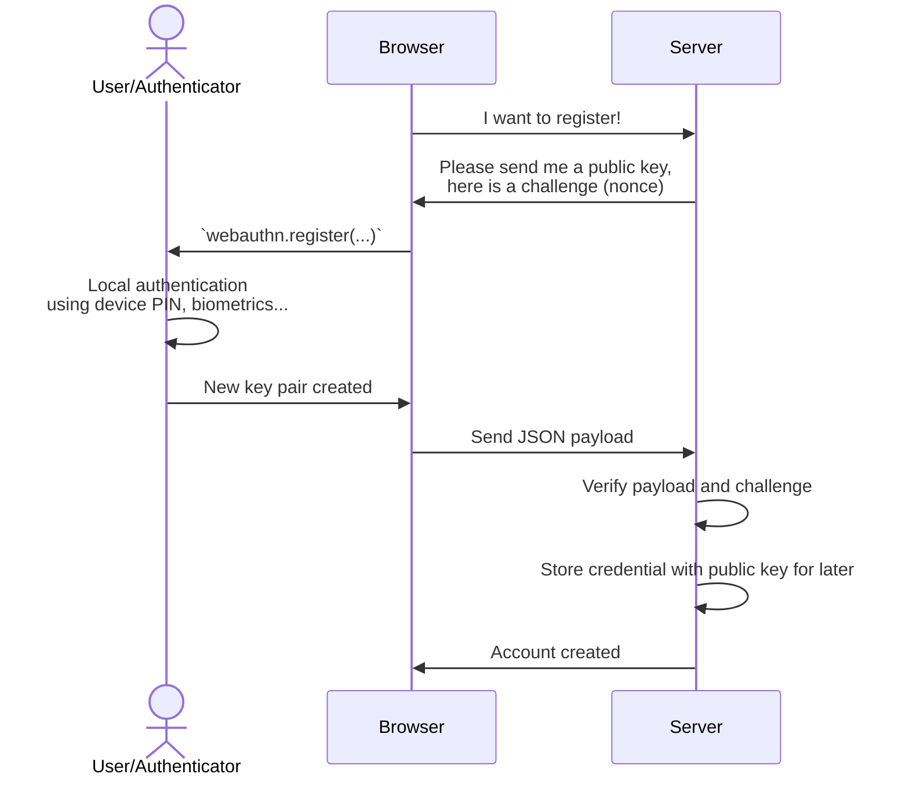

Registration
============

Overview
--------




1️⃣ Requesting a challenge from the server
-----------------------------------------

The challenge is basically a [nonce](https://en.wikipedia.org/wiki/nonce) to avoid replay attacks.
It must be a truly random and non-deterministic byte buffer encoded as *byte64url*.

```js
import { server } from '@passwordless-id/webauthn'

const challenge = server.randomChallenge()
```

Remember the challenge on the server side during a certain amount of time and "consume" it once used.

> There are two ways to deal with remembering the challenge. Either store it in a global cache containing all challenges, or by creating a (cookie based) session directly and storing it as part of the session data.


2️⃣ Trigger the registration in browser
--------------------------------------

Example call:

```js
import { client } from '@passwordless-id/webauthn' 

const registration = await client.register({
  user: "Arnaud Dagnelies",
  challenge: "A server-side randomly generated string",
  /* possibly other options */
})
```

Besides the required `user` and `challenge`, it has following options.

| option | default | description |
|--------|---------|-------------|
| `hints` | `[]` | Which device to use as authenticator, by order of preference. Possible values: `client-device`, `security-key`, `hybrid` (delegate to smartphone).
| `userVerification` | `preferred` | Whether the user verification (using local authentication like fingerprint, PIN, etc.) is `required`, `preferred` or `discouraged`.
| `discoverable` | `preferred` | If the credential is "discoverable", it can be selected using `authenticate` without providing credential IDs. In that case, a native pop-up will appear for user selection. This may have an impact on the "passkeys" user experience and syncing behavior of the key. Possible values are `required`, `preferred` and `discouraged`.
| `timeout` | - |  How long the native authentication popup stays open before aborting the authentication process.
| `attestation` | `true` | Whether or not to provide "attestation" in the result. The attestation can be used to prove the authenticator device model's authenticity. Note that not all authenticators provide this (looking at you apple), it might be anonymized, and its verification is complex.
| `domain` | `window.location.hostname` | This can be set to a parent domain, to have the passkey valid for all subdomains.
| `customProperties` | `{}` | An object of additional properties that will be merged into the WebAuthn create options. This can be used to explicitly set fields such as `extensions`.


3️⃣ Send the payload to the server
---------------------------------

> By default, the native WebAuthn protocol does not result in a serializable object. The protocol in its third iteration provided a `toJSON()` function but its support is [not widespread](https://developer.mozilla.org/en-US/docs/Web/API/PublicKeyCredential/toJSON#browser_compatibility). This library results in the same format, with the addition of a `user` property for more comfort.


The result `registration` object looks like this:

```json
{
  "type": "public-key",
  "id": "L10e_letUcC5nKayX3rMWN_aBY1pyDQfsPb4Tq_8vIo",
  "rawId": "L10e_letUcC5nKayX3rMWN_aBY1pyDQfsPb4Tq_8vIo=",
  "authenticatorAttachment": "cross-platform",
  "clientExtensionResults": {},
  "response": {
    "attestationObject": "o2NmbXRmcGFja2VkZ2F0dFN0bXSjY2FsZyZjc2lnWEYwRAIgWyQipZIS0ocYBL-UX9xGXhI60li5U7wmxlRbDtWFkHsCIDlkKM-_pqOTAWPrJJ0x_Q4eLsYEKneQFIJou6qyaC9eY3g1Y4FZAdgwggHUMIIBeqADAgECAgEBMAoGCCqGSM49BAMCMGAxCzAJBgNVBAYTAlVTMREwDwYDVQQKDAhDaHJvbWl1bTEiMCAGA1UECwwZQXV0aGVudGljYXRvciBBdHRlc3RhdGlvbjEaMBgGA1UEAwwRQmF0Y2ggQ2VydGlmaWNhdGUwHhcNMTcwNzE0MDI0MDAwWhcNNDUwNjIwMDgzOTEyWjBgMQswCQYDVQQGEwJVUzERMA8GA1UECgwIQ2hyb21pdW0xIjAgBgNVBAsMGUF1dGhlbnRpY2F0b3IgQXR0ZXN0YXRpb24xGjAYBgNVBAMMEUJhdGNoIENlcnRpZmljYXRlMFkwEwYHKoZIzj0CAQYIKoZIzj0DAQcDQgAEjWF-ZclQjmS8xWc6yCpnmdo8FEZoLCWMRj__31jf0vo-bDeLU9eVxKTf-0GZ7deGLyOrrwIDtLiRG6BWmZThAaMlMCMwDAYDVR0TAQH_BAIwADATBgsrBgEEAYLlHAIBAQQEAwIFIDAKBggqhkjOPQQDAgNIADBFAiEAwxO40zwx1TBr4V05D_cHqdaCrThO-ZyyIzkgH9QcBpICICrerGEd6cX8PY0ipJPOkjkEWR8SwbxQjjm57cVsVT5uaGF1dGhEYXRhWKRPsghW8kpq59r8J4EJCshHeubivQcmYCNsxhTG-3wuoEUAAAABAQIDBAUGBwgBAgMEBQYHCAAgL10e_letUcC5nKayX3rMWN_aBY1pyDQfsPb4Tq_8vIqlAQIDJiABIVggxZ3bQ9Xa4kbrskcobWw8Drr4Facf074_o9GbN_g56L8iWCAV2IOeHxBrcNS35XQFD1VoGWiO0Aqx3QnmVst3aCz6rg==",
    "authenticatorData": "T7IIVvJKaufa_CeBCQrIR3rm4r0HJmAjbMYUxvt8LqBFAAAAAQECAwQFBgcIAQIDBAUGBwgAIC9dHv5XrVHAuZymsl96zFjf2gWNacg0H7D2-E6v_LyKpQECAyYgASFYIMWd20PV2uJG67JHKG1sPA66-BWnH9O-P6PRmzf4Oei_IlggFdiDnh8Qa3DUt-V0BQ9VaBlojtAKsd0J5lbLd2gs-q4=",
    "clientDataJSON": "eyJ0eXBlIjoid2ViYXV0aG4uY3JlYXRlIiwiY2hhbGxlbmdlIjoibHpwQnRUaFFyQUttckxOYWFidHRZbGpaIiwib3JpZ2luIjoiaHR0cHM6Ly93ZWJhdXRobi5wYXNzd29yZGxlc3MuaWQiLCJjcm9zc09yaWdpbiI6ZmFsc2V9",
    "publicKey": "MFkwEwYHKoZIzj0CAQYIKoZIzj0DAQcDQgAExZ3bQ9Xa4kbrskcobWw8Drr4Facf074_o9GbN_g56L8V2IOeHxBrcNS35XQFD1VoGWiO0Aqx3QnmVst3aCz6rg==",
    "publicKeyAlgorithm": -7,
    "transports": [
      "usb"
    ]
  },
  "user": {
    "name": "Arnaud",
    "id": "4aa4df5f-1666-4400-aca5-3b627cc9008a"
  }
}
```

Then simply send this object as JSON to the server.

> The JSON payload may seem strange and complex. That's because it is mirroring the native WebAuthn API's result. That way, it is also compatible with most other WebAuthn server libraries also "consuming" this format. In other words, while you can use this library for server-side verification, other libraries should work fine too.


4️⃣ Verifying the registration on the server
-------------------------------------------

To verify it server side, call the `verifyRegistration(...)` function. While registration is basically "trust on first use", some basic checks are necessary. The most important one is to check if it matches the expected `challenge` used when initiating the registration procedure, and if the `origin` is the expected one.

```js
import { server } from '@passwordless-id/webauthn' 

const expected = {
    challenge: "Whatever was randomly generated by the server",
    origin: "http://localhost:8080",
}
const registrationParsed = await server.verifyRegistration(registration, expected)
```

While this is the minimal verification, further verifications are possible.

| Verification options | Description |
|-------|-------------|
| `userVerified` | To ensure that the user has been verified by the authenticator.
| `counter` | This should be an incrementing value on each authentication, but it was made optional according to https://github.com/passwordless-id/webauthn/issues/38 since some authenticators (like Apple) do not increment it! 
| `domain` | In the case you used a specific domain (relying party id) during registration/authentication, you need this too during verification.
| `verbose` | Prints more details to the console if enabled

Either this operation fails and throws an Error, or the verification is successful and returns the parsed registration.
Example result:

```json
{
  "authenticator": {
    "aaguid": "01020304-0506-0708-0102-030405060708",
    "counter": 1,
    "icon_light": "https://webauthn.passwordless.id/authenticators/01020304-0506-0708-0102-030405060708-light.png",
    "icon_dark": "https://webauthn.passwordless.id/authenticators/01020304-0506-0708-0102-030405060708-dark.png",
    "name": "Chromium Virtual Authenticator (browser dev tools)"
  },
  "credential": {
    "id": "L10e_letUcC5nKayX3rMWN_aBY1pyDQfsPb4Tq_8vIo",
    "publicKey": "MFkwEwYHKoZIzj0CAQYIKoZIzj0DAQcDQgAExZ3bQ9Xa4kbrskcobWw8Drr4Facf074_o9GbN_g56L8V2IOeHxBrcNS35XQFD1VoGWiO0Aqx3QnmVst3aCz6rg==",
    "algorithm": "ES256",
    "transports": [
      "usb"
    ]
  },
  "synced": false,
  "user": {
    "name": "Arnaud",
    "id": "4aa4df5f-1666-4400-aca5-3b627cc9008a"
  },
  "userVerified": true
}
```

Using that call, the JSON payload is verified and parsed. 

> **NOTE:** Currently, the *attestation* that proves the exact model type of the authenticator is *not verified*. [Do I need attestation?](https://medium.com/webauthnworks/webauthn-fido2-demystifying-attestation-and-mds-efc3b3cb3651). While accepting any authenticator is the generic use case, relying parties that want to only allow specific authenticators would need another library to perform the *attestation* verification. Note that authenticators using synced passkeys, like Apple or Google, do not provide *attestation* at all.


5️⃣ Store the credential / key
-----------------------------

The credential containing the public key is the most important part. It should be stored in a database for later since it will be used to verify the authentication signature.

```json
"credential": {
    "id": "L10e_letUcC5nKayX3rMWN_aBY1pyDQfsPb4Tq_8vIo",
    "publicKey": "MFkwEwYHKoZIzj0CAQYIKoZIzj0DAQcDQgAExZ3bQ9Xa4kbrskcobWw8Drr4Facf074_o9GbN_g56L8V2IOeHxBrcNS35XQFD1VoGWiO0Aqx3QnmVst3aCz6rg==",
    "algorithm": "ES256",
    "transports": [
      "usb"
    ]
  }
```

*Please note that unlike traditional systems, you might allow a user to have multiple credential keys.
For example, if you allow the user to use multiple device-bound keys and/or registering keys for multiple platforms.*


Remarks
-------

### Register one or multiple passkeys per account?
Note that unlike traditional authentication, it is often useful for a single user account to register multiple credentials passkeys.
While it is not strictly required, it is often more convenient for users with devices using different platforms or hardware-bound authenticators like security keys.

### What's the use of `user.id`?

Replacing a credential or updating the user name.

Regarding the `user`, you can either provide a name as string, or an object like `{id: '...', name: '...', displayName: '...'}`. By default, `name` and `displayName` will be the same. The `id` should not disclose personal information as it can be exposed. Providing the ID can be used to override a credential with a new one, including an updated `name`/`username`.
