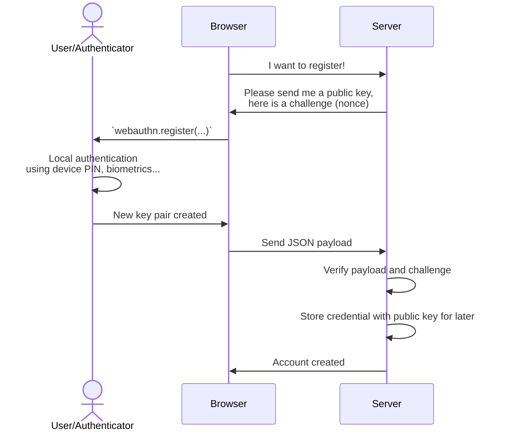

Registration
============

Overview
--------




1. Requesting the challenge from the server
-------------------------------------------

The challenge is basically a [nonce](https://en.wikipedia.org/wiki/nonce) to avoid replay attacks.
This challenge should truly random and not deterministic.

```
const challenge = /* request it from server */
```

Remember the request on the server side during a certain amount of time and "consume" it once used.

> There are two ways to deal with remembering the challenge. Either store it in a global cache containing all challenges, or by creating a (cookie based) session directly and storing it as part of the session data.


2. Trigger the registration in browser
--------------------------------------

Example call:

```js
import { client } from '@passwordless-id/webauthn' 

const registration = await client.register({
  user: "Arnaud Dagnelies",
  challenge: "A server-side randomly generated string",
  /* possibly other options */
})
```

Besides the required `user` and `challenge`, it has following options.

| option | default | description |
|--------|---------|-------------|
| `hints` | `[]` | Which device to use as authenticator, by order of preference. Possible values: `client-device`, `security-key`, `hybrid` (delegate to smartphone).
| `userVerification` | `preferred` | Whether the user verification (using local authentication like fingerprint, PIN, etc.) is `required`, `preferred` or `discouraged`.
| `discoverable` | `preferred` | If the credential is "discoverable", it can be selected using `authenticate` without providing credential IDs. In that case, a native pop-up will appear for user selection. This may have an impact on the "passkeys" user experience and syncing behavior of the key. Possible values are `required`, `preferred` and `discouraged`.
| `timeout` | `60000` |  How long the native authentication popup stays open before aborting the authentication process.
| `attestation` | `true` | Whether or not to provide "attestation" in the result. The attestation can be used to prove the authenticator device model's authenticity. Note that not all authenticators provide this (looking at you apple), it might be anonymized, and its verification is complex.
| `domain` | `window.location.hostname` | This can be set to a parent domain, to have the passkey valid for all subdomains.


3. Send the payload to the server
---------------------------------

> By default, the native WebAuthn protocol does not result in a serializable object. The protocol in its third iteration provided a `toJSON()` function but its support is [not widespread](https://developer.mozilla.org/en-US/docs/Web/API/PublicKeyCredential/toJSON#browser_compatibility). This library results in the same format, with the addition of a `user` property for more comfort.


The result `registration` object looks like this:

```json
{
  "user": {
    "id": "7f26f9ab-4fbc-4103-807f-ed145acb7ecc",
    "name": "Arnaud",
    "displayName": "Arnaud"
  },
  "credential": {
    "id": "3924HhJdJMy_svnUowT8eoXrOOO6NLP8SK85q2RPxdU",
    "publicKey": "MFkwEwYHKoZIzj0CAQYIKoZIzj0DAQcDQgAEgyYqQmUAmDn9J7dR5xl-HlyAA0R2XV5sgQRnSGXbLt_xCrEdD1IVvvkyTmRD16y9p3C2O4PTZ0OF_ZYD2JgTVA==",
    "algorithm": "ES256"
  },
  "authenticatorData": "SZYN5YgOjGh0NBcPZHZgW4_krrmihjLHmVzzuoMdl2NFAAAAAAiYcFjK3EuBtuEw3lDcvpYAIN_duB4SXSTMv7L51KME_HqF6zjjujSz_EivOatkT8XVpQECAyYgASFYIIMmKkJlAJg5_Se3UecZfh5cgANEdl1ebIEEZ0hl2y7fIlgg8QqxHQ9SFb75Mk5kQ9esvadwtjuD02dDhf2WA9iYE1Q=",
  "clientData": "eyJ0eXBlIjoid2ViYXV0aG4uY3JlYXRlIiwiY2hhbGxlbmdlIjoiYTdjNjFlZjktZGMyMy00ODA2LWI0ODYtMjQyODkzOGE1NDdlIiwib3JpZ2luIjoiaHR0cDovL2xvY2FsaG9zdDo4MDgwIiwiY3Jvc3NPcmlnaW4iOmZhbHNlfQ=="
}
```

Then simply send this object as JSON to the server.


4. Verifying the registration on the server
-------------------------------------------


Remarks
-------

### Register one or multiple passkeys per account?
Note that unlike traditional authentication, it is often useful for a single user account to register multiple credentials passkeys.
While it is not strictly required, it is often more convenient for users with devices using different platforms or hardware-bound authenticators like security keys.

### What's the use of `user.id`?

Replacing a credential or updating the user name.

Regarding the `user`, you can either provide a name as string, or an object like `{id: '...', name: '...', displayName: '...'}`. By default, `name` and `displayName` will be the same. The `id` should not disclose personal information as it can be exposed. Providing the ID can be used to override a credential with a new one, including an updated `name`/`username`.
